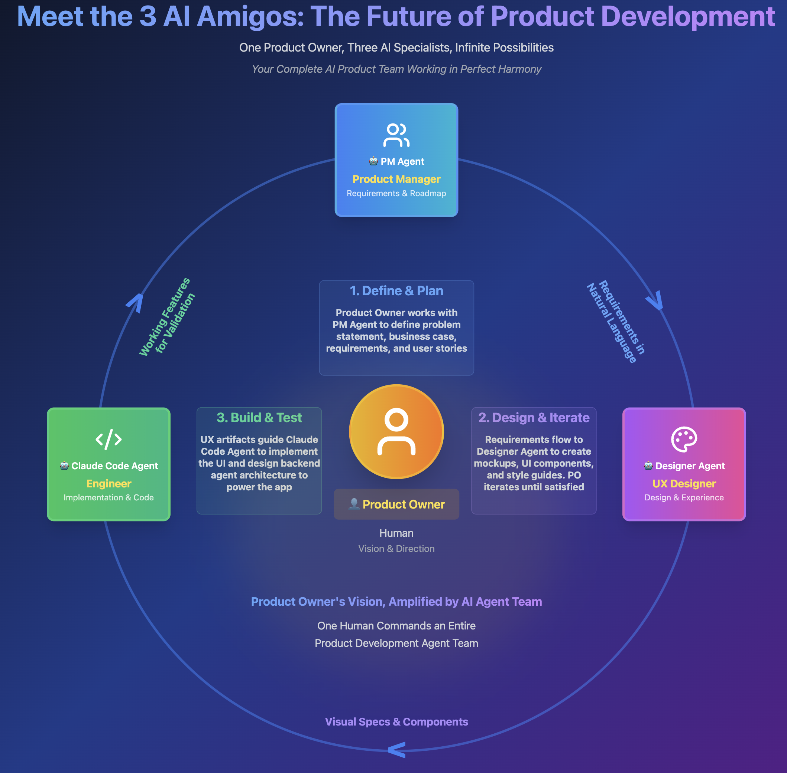

# 🤖 3 AI Amigos: Multi-Agent Product Development Team

> Transform your development workflow with AI-powered Product Manager, UX Designer, and Claude Code working in perfect harmony. Build production-ready multi-agent systems in hours, not months.

## 📖 Table of Contents

- [Overview](#-overview)
- [Repository Structure](#-repository-structure)
- [Quick Start](#-quick-start)
- [Complete Setup Guide](#-complete-setup-guide)
- [Health Insight System Demo](#-health-insight-system-demo)
- [Creating Your Own Use Case](#-creating-your-own-use-case)
- [Technical Architecture](#-technical-architecture)
- [FAQ](#-faq)
- [Contributing](#-contributing)
- [Resources](#-resources)

## 🌟 Overview

The **3 AI Amigos** revolutionizes how we build multi-agent systems by orchestrating three specialized AI agents that mirror traditional software development roles:

1. **Product Manager Agent** - Creates PRDs, user stories, and technical architecture
2. **UX Designer Agent** - Designs interfaces, creates prototypes, and defines experiences
3. **Claude Code Agent** - Implements the complete system following specifications

This pattern is based on Anthropic's research showing **90.2% performance improvement** with multi-agent systems over single agents.

<p align="center">
  
</p>

The 3 AI Amigos orchestrates these specialized AI agents in a continuous development cycle:

1. **Define & Plan** - Product Owner collaborates with PM Agent to create requirements and architecture
2. **Design & Iterate** - Requirements flow to UX Designer Agent for design specs and prototypes  
3. **Build & Test** - UX artifacts guide Claude Code to implement the complete system

This creates a seamless flow where human vision is amplified by AI expertise at every stage.

### 🎯 Key Benefits

- ⚡ **10x Faster Development** - From idea to working system in hours
- 🔄 **Reusable Patterns** - Technical guides work for any domain
- 🎨 **Professional UX** - AI-designed interfaces that users love
- 🏗️ **Production Ready** - Following Anthropic's best practices
- 🔧 **Domain Agnostic** - Works for health, finance, legal, education, etc.

## 📁 Repository Structure

```
3-AMIGO-AGENTS/
│
├── 🤖 agents/                    # Reusable agent configurations
│   ├── pm-agent/                 # Product Manager Agent
│   │   ├── config/               # Agent instructions
│   │   ├── example/              # Example outputs and prompts
│   │   │   ├── prompts/          # What to submit to PM
│   │   │   └── generated-pm-artifacts/ # Example PM outputs
│   ├── ux-agent/                 # UX Designer Agent
│   │   ├── config/               # Agent instructions
│   │   ├── example/              # Example outputs and prompts
│   │   │   ├── prompts/          # What to submit to UX
│   │   │   └── generated-ux-artifacts/ # Example UX outputs
│   └── code-agent/               # Claude Code configuration
│       └── config/               # CLAUDE.md template
│
├── 📚 technical-patterns/        # Domain-agnostic patterns
│   ├── implementation-guide.md   # Multi-agent implementation
│   ├── multi-agent-patterns-doc.md   # Orchestrator-worker patterns
│   ├── streaming-patterns-doc.md     # Real-time SSE updates
│   ├── dependency-management-guide.md  # Critical version requirements
│   └── sse-implementation-guide.md     # SSE best practices
│
├── 🏥 use-cases/                 # Domain-specific examples
│   └── multi-agent-health-insight-system/
│       ├── health-domain-requirements.md
│       ├── health-system-architecture-guide.md  # Combined architecture doc
│       ├── health-mcp-tool-interface.md        # Health MCP tools
│       ├── health-user-stories.pdf             # User stories & mockups
│       ├── health-insight-brand-guidelines.md
│       └── Anthropic-Blog-[...].txt
│
├── 📖 docs/                      # Setup guides
│   ├── demo-setup-guide.md
│   ├── po-document-checklist.md
│   ├── requirements-directory-structure.md
│   └── images/
│       └── ai-amigos-diagram.png
│
└── README.md                     # You are here!
```

## 🚀 Quick Start

### Prerequisites

- **Claude Desktop** or **Claude.ai** account (for PM and UX agents)
- **Claude Code** installed ([Get it here](https://claude.ai/code))
- **VSCode** or preferred editor
- **Python 3.11+** for backend
- **Node.js 18+** for frontend
- Basic understanding of multi-agent systems ([Read Anthropic's blog](https://www.anthropic.com/engineering/built-multi-agent-research-system))

### 30-Second Overview

1. **Create Agents** → Set up PM and UX agents in Claude Desktop
2. **Run PM Agent** → Upload domain requirements, get product specs
3. **Run UX Agent** → Upload PM outputs, get designs
4. **Setup Workspace** → Organize all outputs for Claude Code
5. **Run Claude Code** → Get working system!

## 📋 Complete Setup Guide

### Phase 1: Create Your AI Agents

#### 1.1 Create Product Manager Agent

**In Claude Desktop:**
1. Click "Create New Project"
2. Name: "Product Manager Agent"
3. Description: Copy from `agents/pm-agent/config/pm-agent-description.md`
4. Copy instructions from: `agents/pm-agent/config/pm-agent-instructions.md`
5. Paste into project instructions
6. Save project

#### 1.2 Create UX Designer Agent

**In Claude Desktop:**
1. Click "Create New Project"
2. Name: "UX Designer Agent"
3. Description: Copy from `agents/ux-agent/config/ux-agent-description.md`
4. Copy instructions from: `agents/ux-agent/config/ux-designer-agent-instructions.md`
5. Paste into project instructions
6. Save project

### Phase 2: Prepare Your Documents

#### For Health Insight System Demo:
Use provided documents in `use-cases/multi-agent-health-insight-system/`:
- ✅ All documents ready to use
- ✅ Skip to Phase 3

#### For Custom Use Case:
Create these documents (use health examples as templates):

1. **[domain]-requirements.md** - Your domain expertise
2. **[domain]-system-architecture-guide.md** - Combined architecture document with multi-agent patterns
3. **[domain]-mcp-tool-interface.md** - If you have pre-built MCP tools
4. **Visual references** - Screenshots/PDF showing desired UI/UX (optional but recommended)
5. **[domain]-brand-guidelines.md** - Visual identity based on visual references
6. **Anthropic blog** - [Link](https://www.anthropic.com/engineering/built-multi-agent-research-system)

### Phase 3: Run the AI Amigos

#### 3.1 Product Manager Agent

1. Open PM Agent project in Claude Desktop
2. Start new conversation
3. Copy prompt from: `agents/pm-agent/example/prompts/po-prompt-for-pm-agent.md`
4. Customize for your domain
5. Attach your documents (4-6 files) to the message
6. Submit and wait for outputs

**PM Agent will create:**
- 📄 PRD.md
- 📝 user-stories.md
- 🏗️ system-architecture.md
- 🔌 api-specification.md
- 📊 data-models.md
- 🛠️ tool-interface.md
- 📋 feature-priority.md

#### 3.2 UX Designer Agent

1. Open UX Agent project
2. Start new conversation  
3. Copy prompt from: `agents/ux-agent/example/prompts/po-prompt-for-ux-agent.md`
4. Attach all PM outputs + visual references (PDF/screenshots) to the message
5. Submit and wait for designs

**UX Agent will create:**
- 🎨 design-system.md
- 🧩 component-specs.md
- 📱 welcome-prototype.html
- 📱 main-app-prototype.html
- 📐 layout-guidelines.md
- 📊 visualization-specs.md
- ♿ accessibility-guidelines.md
- 🎬 animation-specs.md

### Phase 4: Prepare Claude Code Workspace

#### 4.1 Create Workspace Structure

```bash
mkdir my-awesome-system
cd my-awesome-system

# Create directory structure
mkdir -p backend/tools
mkdir -p frontend
mkdir -p requirements/{technical-patterns,pm-outputs/architecture,ux-outputs/prototypes,po-inputs}
```

#### 4.2 Copy Technical Guides (Reusable)

```bash
# Copy from this repo's technical-patterns/
cp path/to/3-AMIGO-AGENTS/technical-patterns/* requirements/technical-patterns/
```

**Critical**: Include these new guides:
- `dependency-management-guide.md` - Exact versions to prevent conflicts
- `sse-implementation-guide.md` - Correct SSE patterns

#### 4.3 Add PM Outputs

Place in `requirements/pm-outputs/`:
- PRD.md, user-stories.md, feature-priority.md (root level)
- architecture/ → PM's technical documents (api-specification.md, data-models.md, system-architecture.md, tool-interface.md)

**Important**: Check api-specification.md for correct SSE endpoint (should be GET, not POST)

#### 4.4 Add UX Outputs

Place in `requirements/ux-outputs/`:
- All design documents
- prototypes/ folder (containing HTML prototypes)

#### 4.5 Add Domain Input Documents

Place in `requirements/po-inputs/`:
- Your original domain requirements
- Tool documentation (if any)
- Anthropic blog

#### 4.6 Create CLAUDE.md

Copy the template from `agents/code-agent/config/minimal-claude-md-template.md` to your workspace root:

```bash
cp path/to/3-AMIGO-AGENTS/agents/code-agent/config/minimal-claude-md-template.md CLAUDE.md
```

Then edit `CLAUDE.md` to replace:
- `[PROJECT_NAME]` with your system name
- `[ONE_LINE_DESCRIPTION]` with a brief description

This template ensures Claude Code will:
- Review all requirements before implementing
- Create a comprehensive plan and get your approval
- Avoid duplicate todo entries
- Follow a structured implementation process

### Phase 5: Run Claude Code

1. Open terminal in your workspace
2. Run: `claude-code`
3. Claude Code will:
   - Read CLAUDE.md and analyze all requirements
   - Create a comprehensive implementation plan
   - **Present the plan for your review and approval**
   - Only proceed with implementation after you confirm
   - Provide running instructions when complete

## 🏥 Health Insight System Demo

To run the complete health insight system demo:

### What You'll Build

A sophisticated multi-agent health analysis system featuring:
- 🧠 **Chief Medical Officer (CMO)** orchestrator agent
- 👥 **8 Medical Specialists** (Cardiology, Endocrinology, etc.)
- 📊 **Real-time Analysis** with SSE streaming
- 📈 **Dynamic Visualizations** generated by AI
- 🎨 **Beautiful Medical UI** with glassmorphism effects

### Demo Steps

1. **Use Provided Health Documents**
   ```
   use-cases/multi-agent-health-insight-system/
   ├── health-domain-requirements.md
   ├── health-system-architecture-guide.md
   ├── health-mcp-tool-interface.md
   ├── health-user-stories.pdf
   ├── health-insight-brand-guidelines.md
   └── Anthropic-Blog-[...].txt
   ```

2. **Copy Technical Patterns** (CRITICAL)
   ```bash
   cp technical-patterns/* your-workspace/requirements/technical-patterns/
   ```
   Especially: dependency-management-guide.md, sse-implementation-guide.md

3. **Follow Phases 1-5** above with health documents

4. **Expected Output Structure**
   ```
   health-insight-system/
   ├── backend/
   │   ├── main.py              # FastAPI server
   │   ├── services/            # Multi-agent orchestration
   │   ├── agents/              # CMO + specialists
   │   └── tools/               # Pre-built health tools
   ├── frontend/
   │   ├── src/
   │   │   ├── components/      # React components
   │   │   └── services/        # API integration
   │   └── package.json
   └── requirements/            # All specifications
   ```

5. **Run the System**
   ```bash
   # Backend
   cd backend
   pip install -r requirements.txt
   python main.py  # or uvicorn main:app --reload
   
   # Frontend (new terminal)
   cd frontend
   npm install
   npm run dev
   ```

6. **Access at** http://localhost:5173 (Vite default)

7. **Common Issues**:
   - If Tailwind CSS errors: Ensure v3.3.0, not v4
   - If SSE not streaming: Check for GET endpoint and headers
   - If TypeScript errors: Use `import type` for type imports

## 🎯 Creating Your Own Use Case

### Example: Financial Advisory System

1. **Create Domain Documents**
   ```markdown
   # finance-domain-requirements.md
   - Asset classes: stocks, bonds, crypto
   - Analysis types: risk, performance, allocation
   - User queries: "Optimize my portfolio", "Tax implications"
   ```
   Plus: Dashboard screenshots showing portfolio views

2. **Run Through AI Amigos**
   - PM creates: Chief Investment Officer + specialists
   - UX creates: Financial dashboards matching your visual references
   - Claude Code: Implements complete system

### Example: Legal Document Analyzer

1. **Create Domain Documents**
   ```markdown
   # legal-domain-requirements.md
   - Document types: contracts, patents, compliance
   - Analysis needs: risk assessment, clause extraction
   - Specialists: Contract Lawyer, IP Expert, Compliance Officer
   ```

2. **Same pattern, different domain!**

## 🔧 Technical Architecture

### Multi-Agent Orchestration

```python
# The pattern works like this:
Orchestrator (CMO/CIO/Senior Counsel)
    ├── Analyzes request complexity
    ├── Creates specialist tasks
    ├── Executes specialists in parallel
    ├── Synthesizes results
    └── Generates visualizations
```

### Real-time Streaming

```typescript
// SSE provides live updates:
- Specialist activation
- Progress indicators  
- Partial results
- Final synthesis
```

### Key Technologies

- **Backend**: FastAPI 0.104.1, Anthropic SDK 0.39.0, SSE (sse-starlette 1.8.2)
- **Frontend**: React 18.2.0, TypeScript 5.2.2, Tailwind CSS 3.3.0 (NOT v4)
- **Patterns**: Orchestrator-Worker, Progressive Disclosure
- **Streaming**: GET endpoints with EventSource, X-Accel-Buffering headers
- **Based on**: [Anthropic's Research](https://www.anthropic.com/engineering/built-multi-agent-research-system)

## ❓ FAQ

<details>
<summary><b>Do I need to create brand guidelines?</b></summary>

It's highly recommended! If you have screenshots or visual references of your desired UI, create a brand guidelines document (see health example). This ensures the UX Designer Agent creates consistent, on-brand designs that match your vision.
</details>

<details>
<summary><b>Can I use this for non-health domains?</b></summary>

Absolutely! The 3 AI Amigos is domain-agnostic. Just create your own domain documents and follow the same process. We've included examples for finance, legal, and education systems.
</details>

<details>
<summary><b>Do I need to know how to code?</b></summary>

No! The AI agents handle all the coding. You just need to understand your domain and be able to describe what you want to build.
</details>

<details>
<summary><b>What if I already have some tools/APIs?</b></summary>

Perfect! Document them in a tool-interface-document.md and place any pre-built tools in backend/tools/. The agents will use them.
</details>

<details>
<summary><b>How long does the whole process take?</b></summary>

Typically 2-4 hours from start to working system:
- PM Agent: 30-45 minutes
- UX Agent: 30-45 minutes  
- Workspace setup: 15 minutes
- Claude Code: 45-90 minutes
</details>

<details>
<summary><b>Can I modify the agent instructions?</b></summary>

Yes! The agent instructions in `agents/*/config/` can be customized for your needs. Just maintain the core structure.
</details>

## 🤝 Contributing

We welcome contributions! See our [Contributing Guide](CONTRIBUTING.md) for details.

### Ways to Contribute

- 🎯 Add new use cases
- 📚 Improve documentation
- 🐛 Report issues
- ⭐ Star this repo!

## 📚 Resources

### Essential Reading
- 📖 [Blog: Building Multi-Agent Systems with 3 AI Amigos](#) *(Coming Soon)*
- 🎥 [Video: Complete Demo Walkthrough](#) *(Coming Soon)*
- 📄 [Anthropic's Multi-Agent Research](https://www.anthropic.com/engineering/built-multi-agent-research-system)

### Get Help
- 💬 [Discussions](https://github.com/your-username/3-AMIGO-AGENTS/discussions)
- 🐛 [Issues](https://github.com/your-username/3-AMIGO-AGENTS/issues)
- 📧 Email: your.email@example.com

### Connect
- 🐦 Twitter: [@yourhandle](#)
- 💼 LinkedIn: [Your Name](#)
- 🌐 Website: [yourwebsite.com](#)

---

<p align="center">
  <b>🌟 If this helps you build something amazing, please star the repo and share your story!</b>
</p>

<p align="center">
  Made with ❤️ by [Your Name] using the 3 AI Amigos
</p>

<p align="center">
  <a href="#-3-ai-amigos-multi-agent-product-development-team">⬆ Back to Top</a>
</p>