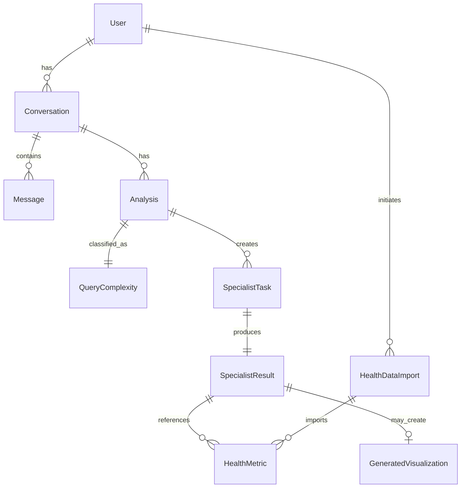

# Data Model Documentation: Multi-Agent Health Insight System

## Overview

This document defines all data entities, their relationships, and validation rules used in the Multi-Agent Health Insight System. The models are designed to support real-time streaming, multi-agent orchestration, and comprehensive health data analysis.

## Core Entities

### 1. User Query Models

#### ChatRequest
Represents an incoming user query to the system.

```python
class ChatRequest(BaseModel):
    message: str                           # The health-related query
    conversation_id: Optional[str] = None  # For conversation continuity
    user_id: Optional[str] = None         # For demo purposes
    context: Optional[Dict] = None        # Additional context
    
    class Config:
        example = {
            "message": "What's my cholesterol trend over the last 15 years?",
            "conversation_id": "conv_123abc",
            "user_id": "user_456def"
        }
```

**Validation Rules**:
- `message`: Required, 1-1000 characters
- `conversation_id`: Optional, UUID format if provided
- `user_id`: Optional, alphanumeric + underscore

#### QueryComplexity
Represents the CMO's assessment of query complexity.

```python
class ComplexityLevel(str, Enum):
    SIMPLE = "SIMPLE"        # Single data point retrieval
    STANDARD = "STANDARD"    # Trend analysis, 2-3 specialists
    COMPLEX = "COMPLEX"      # Multi-domain correlation, 4-6 specialists
    CRITICAL = "CRITICAL"    # Comprehensive assessment, all relevant specialists

class QueryComplexity(BaseModel):
    level: ComplexityLevel
    reasoning: str
    estimated_specialists: int
    estimated_duration_ms: int
    requires_visualization: bool
```

### 2. Agent Models

#### MedicalSpecialty
Enumeration of all medical specialist types.

```python
class MedicalSpecialty(str, Enum):
    GENERAL_PRACTICE = "general_practice"
    ENDOCRINOLOGY = "endocrinology"
    CARDIOLOGY = "cardiology"
    NUTRITION = "nutrition"
    PREVENTIVE_MEDICINE = "preventive_medicine"
    LABORATORY_MEDICINE = "laboratory_medicine"
    PHARMACY = "pharmacy"
    DATA_ANALYSIS = "data_analysis"
```

#### SpecialistTask
Represents a task assigned by the CMO to a specialist.

```python
class SpecialistTask(BaseModel):
    id: str = Field(default_factory=lambda: f"task_{uuid4().hex[:8]}")
    specialist: MedicalSpecialty
    task_description: str
    priority: int = Field(ge=1, le=10, default=5)
    context: Dict[str, Any]
    created_at: datetime = Field(default_factory=datetime.utcnow)
    
    class Config:
        example = {
            "id": "task_abc123",
            "specialist": "cardiology",
            "task_description": "Analyze 15-year cholesterol trends",
            "priority": 8,
            "context": {
                "focus_metrics": ["LDL", "HDL", "triglycerides"],
                "time_period": "2010-2025"
            }
        }
```

#### SpecialistStatus
Real-time status of a specialist's work.

```python
class AgentStatus(str, Enum):
    WAITING = "waiting"
    ACTIVE = "active"
    COMPLETE = "complete"
    ERROR = "error"

class SpecialistStatus(BaseModel):
    specialist: MedicalSpecialty
    status: AgentStatus
    progress: int = Field(ge=0, le=100, default=0)
    current_activity: Optional[str] = None
    started_at: Optional[datetime] = None
    completed_at: Optional[datetime] = None
    confidence: Optional[float] = Field(ge=0, le=100, default=None)
```

#### SpecialistResult
Complete results from a specialist's analysis.

```python
class SpecialistResult(BaseModel):
    specialist: MedicalSpecialty
    task_id: str
    findings: str                    # Markdown formatted findings
    confidence: float = Field(ge=0, le=100)
    key_insights: List[str]         # Bullet points for synthesis
    data_points: List[Dict]         # Structured data for visualization
    recommendations: List[str]       # Action items
    tool_calls_made: int
    tokens_used: int
    duration_ms: int
    
    class Config:
        example = {
            "specialist": "cardiology",
            "task_id": "task_abc123",
            "findings": "## Cardiovascular Analysis\n\nYour cholesterol shows...",
            "confidence": 85.5,
            "key_insights": [
                "LDL cholesterol trending upward since 2021",
                "HDL levels remain in healthy range"
            ],
            "data_points": [
                {"date": "2024-01-15", "ldl": 140, "hdl": 55}
            ],
            "recommendations": [
                "Consider dietary modifications",
                "Schedule cardiovascular screening"
            ],
            "tool_calls_made": 3,
            "tokens_used": 2500,
            "duration_ms": 4500
        }
```

### 3. Health Data Models

#### HealthMetric
Base model for any health measurement.

```python
class HealthMetric(BaseModel):
    metric_name: str
    value: Union[float, str]
    unit: Optional[str] = None
    date: date
    reference_range: Optional[Dict[str, float]] = None
    status: Optional[str] = None  # "normal", "high", "low", "critical"
    
    @validator('status')
    def validate_status(cls, v):
        if v and v not in ["normal", "high", "low", "critical"]:
            raise ValueError("Invalid status")
        return v
```

#### LabResult
Detailed laboratory test result.

```python
class LabResult(HealthMetric):
    test_category: str           # "lipid_panel", "metabolic_panel", etc.
    provider: Optional[str] = None
    notes: Optional[str] = None
    abnormal_flag: bool = False
    
    class Config:
        example = {
            "metric_name": "LDL Cholesterol",
            "value": 140,
            "unit": "mg/dL",
            "date": "2024-01-15",
            "reference_range": {"min": 0, "max": 100},
            "status": "high",
            "test_category": "lipid_panel",
            "abnormal_flag": True
        }
```

#### Medication
Medication information.

```python
class Medication(BaseModel):
    name: str
    generic_name: Optional[str] = None
    dosage: str
    frequency: str
    start_date: date
    end_date: Optional[date] = None
    prescriber: Optional[str] = None
    indication: Optional[str] = None
    adherence_percentage: Optional[float] = Field(ge=0, le=100, default=None)
```

#### VitalSign
Vital sign measurement.

```python
class VitalSign(BaseModel):
    type: str  # "blood_pressure", "heart_rate", "weight", etc.
    systolic: Optional[int] = None    # For blood pressure
    diastolic: Optional[int] = None   # For blood pressure
    value: Optional[float] = None     # For single-value vitals
    unit: str
    date: date
    time: Optional[time] = None
```

### 4. Streaming Message Models

#### StreamMessage
Base class for all SSE messages.

```python
class MessageType(str, Enum):
    START = "start"
    THINKING = "thinking"
    TOOL_CALL = "tool_call"
    TOOL_RESULT = "tool_result"
    COMPLEXITY_ASSESSMENT = "complexity_assessment"
    TEAM_ASSEMBLED = "team_assembled"
    SPECIALIST_START = "specialist_start"
    SPECIALIST_PROGRESS = "specialist_progress"
    SPECIALIST_COMPLETE = "specialist_complete"
    SYNTHESIS_START = "synthesis_start"
    TEXT = "text"
    VISUALIZATION_START = "visualization_start"
    VISUALIZATION = "visualization"
    ERROR = "error"
    COMPLETE = "complete"

class StreamMessage(BaseModel):
    type: MessageType
    timestamp: datetime = Field(default_factory=datetime.utcnow)
    
class ThinkingMessage(StreamMessage):
    type: Literal[MessageType.THINKING]
    agent: str
    content: str

class ToolCallMessage(StreamMessage):
    type: Literal[MessageType.TOOL_CALL]
    agent: str
    tool: str
    input: Dict[str, Any]

class SpecialistProgressMessage(StreamMessage):
    type: Literal[MessageType.SPECIALIST_PROGRESS]
    specialist: MedicalSpecialty
    progress: int
    current_activity: Optional[str] = None
```

### 5. Visualization Models

#### VisualizationConfig
Configuration for dynamic chart generation.

```python
class ChartType(str, Enum):
    LINE = "line"
    BAR = "bar"
    SCATTER = "scatter"
    AREA = "area"
    PIE = "pie"
    RADAR = "radar"

class VisualizationConfig(BaseModel):
    chart_type: ChartType
    title: str
    x_axis_label: str
    y_axis_label: str
    data_keys: List[str]
    show_reference_ranges: bool = True
    interactive: bool = True
    color_scheme: str = "medical"  # "medical", "colorblind_friendly"
```

#### GeneratedVisualization
Complete visualization with React component code.

```python
class GeneratedVisualization(BaseModel):
    id: str = Field(default_factory=lambda: f"viz_{uuid4().hex[:8]}")
    query_context: str
    component_code: str  # Complete React component as string
    description: str
    chart_configs: List[VisualizationConfig]
    estimated_render_time_ms: int
```

### 6. Conversation Models

#### Message
Individual message in a conversation.

```python
class MessageRole(str, Enum):
    USER = "user"
    ASSISTANT = "assistant"
    SYSTEM = "system"

class Message(BaseModel):
    id: str = Field(default_factory=lambda: f"msg_{uuid4().hex[:8]}")
    role: MessageRole
    content: str
    timestamp: datetime = Field(default_factory=datetime.utcnow)
    metadata: Optional[Dict[str, Any]] = None
```

#### Conversation
Complete conversation with history.

```python
class Conversation(BaseModel):
    id: str = Field(default_factory=lambda: f"conv_{uuid4().hex[:8]}")
    user_id: Optional[str] = None
    messages: List[Message] = []
    created_at: datetime = Field(default_factory=datetime.utcnow)
    updated_at: datetime = Field(default_factory=datetime.utcnow)
    analyses: List[Dict[str, Any]] = []  # Stored analysis results
    active: bool = True
```

### 7. System Models

#### HealthDataImport
Import operation tracking.

```python
class ImportStatus(str, Enum):
    PENDING = "pending"
    PROCESSING = "processing"
    COMPLETED = "completed"
    FAILED = "failed"

class HealthDataImport(BaseModel):
    id: str = Field(default_factory=lambda: f"imp_{uuid4().hex[:8]}")
    user_id: str
    file_directory: str
    status: ImportStatus = ImportStatus.PENDING
    started_at: Optional[datetime] = None
    completed_at: Optional[datetime] = None
    statistics: Optional[Dict[str, Any]] = None
    error_message: Optional[str] = None
```

#### SystemMetrics
Performance and usage metrics.

```python
class SystemMetrics(BaseModel):
    period_start: datetime
    period_end: datetime
    total_queries: int
    complexity_distribution: Dict[ComplexityLevel, int]
    average_response_time_ms: Dict[ComplexityLevel, float]
    specialist_usage: Dict[MedicalSpecialty, int]
    total_tokens_used: int
    error_rate: float
    concurrent_users_peak: int
```

## Entity Relationships



## Validation Rules Summary

### String Fields
- Names: 1-100 characters, alphanumeric + spaces
- IDs: UUID format or custom prefixed format
- Queries: 1-1000 characters
- Content: No length limit but may be truncated for display

### Numeric Fields
- Progress: 0-100 integer
- Confidence: 0-100 float
- Tokens: Non-negative integer
- Duration: Non-negative integer (milliseconds)

### Date/Time Fields
- ISO 8601 format for JSON serialization
- UTC timezone for all timestamps
- Date ranges must be logical (start <= end)

### Arrays
- Empty arrays allowed unless specified
- Maximum 100 items for most arrays
- Maximum 1000 data points for visualizations

## Example Data

### Complete Analysis Flow
```json
{
  "conversation_id": "conv_abc123",
  "query": {
    "message": "Analyze my cholesterol trends",
    "complexity": {
      "level": "STANDARD",
      "estimated_specialists": 2
    }
  },
  "specialists": [
    {
      "specialist": "cardiology",
      "status": "complete",
      "confidence": 85,
      "findings": "Upward LDL trend identified"
    },
    {
      "specialist": "data_analysis", 
      "status": "complete",
      "confidence": 92,
      "findings": "Statistical significance confirmed"
    }
  ],
  "visualization": {
    "id": "viz_def456",
    "chart_type": "line",
    "component_code": "const Chart = () => {...}"
  },
  "synthesis": {
    "summary": "Your cholesterol requires attention...",
    "recommendations": ["Dietary changes", "Follow-up testing"]
  }
}
```

## Migration & Versioning

### Schema Version
Current Version: 1.0.0

### Backward Compatibility
- Optional fields can be added without breaking changes
- Enum values can be added (not removed)
- Field types cannot change
- Required fields cannot be added to existing models

### Forward Compatibility
- Clients should ignore unknown fields
- Use semantic versioning for breaking changes
- Provide migration scripts for data updates