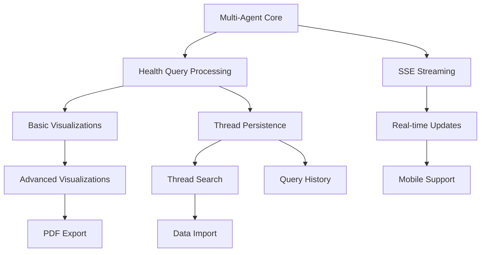

# Feature Priority Matrix - Health Insight Assistant

## Prioritization Framework

Features are evaluated across four dimensions:
- **User Value**: Direct benefit to health outcomes (1-10)
- **Technical Complexity**: Development effort required (1-10, inverse)
- **Risk Mitigation**: Reduces medical/technical risks (1-10)
- **Differentiation**: Competitive advantage (1-10)

**Priority Score** = (User Value × 2) + Risk Mitigation + Differentiation - Technical Complexity

## Priority Levels

### P0 - Critical (Must Have for MVP)
Essential features for basic functionality and safety.

| Feature | User Value | Tech Complexity | Risk Mitigation | Differentiation | Score | Status |
|---------|-----------|----------------|----------------|----------------|-------|--------|
| Multi-Agent Orchestration | 10 | 7 | 9 | 10 | 32 | 🚧 In Progress |
| Basic Health Query Processing | 10 | 4 | 8 | 5 | 29 | 🚧 In Progress |
| SSE Real-time Streaming | 9 | 5 | 7 | 8 | 28 | 🚧 In Progress |
| Error Handling & Retry Logic | 8 | 3 | 10 | 3 | 26 | 📋 Planned |
| Medical Disclaimers & Safety | 7 | 2 | 10 | 2 | 24 | 📋 Planned |
| Basic Visualization (Line Charts) | 9 | 4 | 5 | 6 | 25 | 📋 Planned |
| Thread Persistence (LocalStorage) | 8 | 3 | 6 | 4 | 23 | 📋 Planned |

### P1 - High Priority
Features that significantly enhance user experience and trust.

| Feature | User Value | Tech Complexity | Risk Mitigation | Differentiation | Score | Status |
|---------|-----------|----------------|----------------|----------------|-------|--------|
| Query-based History Navigation | 8 | 5 | 4 | 7 | 22 | 📋 Planned |
| Advanced Visualizations | 8 | 6 | 3 | 8 | 21 | 📋 Planned |
| Thread Search & Filtering | 7 | 4 | 3 | 5 | 19 | 📋 Planned |
| Export to PDF Reports | 9 | 5 | 5 | 6 | 24 | 📋 Planned |
| Confidence Scoring Display | 7 | 3 | 8 | 6 | 23 | 📋 Planned |
| Mobile Responsive Design | 8 | 6 | 3 | 4 | 19 | 📋 Planned |
| Medication Interaction Warnings | 9 | 7 | 9 | 7 | 24 | 📋 Planned |

### P2 - Medium Priority
Enhancements that improve usability and engagement.

| Feature | User Value | Tech Complexity | Risk Mitigation | Differentiation | Score | Status |
|---------|-----------|----------------|----------------|----------------|-------|--------|
| Dark Mode Support | 6 | 3 | 2 | 3 | 16 | 🔮 Future |
| Keyboard Shortcuts | 5 | 4 | 2 | 4 | 14 | 🔮 Future |
| Onboarding Tutorial | 7 | 5 | 5 | 3 | 17 | 🔮 Future |
| Data Import Wizard | 8 | 7 | 4 | 5 | 18 | 🔮 Future |
| Customizable Dashboard | 6 | 6 | 2 | 6 | 16 | 🔮 Future |
| Voice Input Support | 7 | 8 | 3 | 8 | 18 | 🔮 Future |
| Notification System | 5 | 4 | 4 | 3 | 15 | 🔮 Future |

### P3 - Nice to Have
Features for future consideration and competitive advantage.

| Feature | User Value | Tech Complexity | Risk Mitigation | Differentiation | Score | Status |
|---------|-----------|----------------|----------------|----------------|-------|--------|
| Multi-language Support | 6 | 7 | 3 | 7 | 16 | 🔮 Future |
| Wearable Device Integration | 8 | 9 | 4 | 9 | 20 | 🔮 Future |
| Family Account Management | 6 | 8 | 5 | 8 | 17 | 🔮 Future |
| Healthcare Provider Portal | 7 | 9 | 6 | 9 | 19 | 🔮 Future |
| Predictive Health Modeling | 9 | 10 | 7 | 10 | 25 | 🔮 Future |
| API for Third-party Apps | 5 | 6 | 4 | 8 | 16 | 🔮 Future |
| Offline Mode | 6 | 8 | 5 | 6 | 16 | 🔮 Future |

## Release Roadmap

### MVP Release (Month 1)
**Goal**: Functional health analysis with core safety features

**P0 Features**:
- ✅ Multi-Agent Orchestration (CMO + 8 Specialists)
- ✅ Basic Health Query Processing
- ✅ Real-time SSE Streaming
- ✅ Error Handling with Retry Logic
- ✅ Medical Disclaimers
- ✅ Basic Line Chart Visualizations
- ✅ Thread Persistence

**Success Criteria**:
- Process simple to complex health queries
- Zero critical errors in 100 test sessions
- < 5 second response for simple queries
- All medical disclaimers visible

### Phase 2 Release (Month 2)
**Goal**: Enhanced analysis with better UX

**P1 Features Added**:
- ✅ Query-based History Navigation
- ✅ Advanced Visualization Types
- ✅ Thread Search & Filtering
- ✅ PDF Export Functionality
- ✅ Confidence Scoring
- ✅ Mobile Responsive Design

**Success Criteria**:
- 90% user satisfaction score
- Mobile usage > 30%
- Average 3+ queries per session
- Export feature used by 50% of users

### Phase 3 Release (Month 3)
**Goal**: Production-ready with engagement features

**P1/P2 Features Added**:
- ✅ Medication Interaction Warnings
- ✅ Onboarding Tutorial
- ✅ Data Import Wizard
- ✅ Keyboard Shortcuts
- ✅ Performance Optimizations

**Success Criteria**:
- 80% new user completion of onboarding
- < 3 second average response time
- Support 10+ years of health data
- 95% uptime

### Future Releases (Month 4+)
**Goal**: Market differentiation and scale

**P2/P3 Features**:
- Voice Input Support
- Wearable Integration
- Predictive Modeling
- Provider Portal
- Multi-language Support

## Technical Debt Priorities

### High Priority Debt
1. **Component Performance** (P0)
   - Implement React.memo optimization
   - Add virtualization for long lists
   - Lazy load heavy components

2. **Test Coverage** (P1)
   - Unit tests > 80% coverage
   - Integration tests for critical paths
   - E2E tests for main user flows

3. **Accessibility Compliance** (P1)
   - WCAG 2.1 AA compliance
   - Screen reader testing
   - Keyboard navigation

### Medium Priority Debt
1. **Code Organization** (P2)
   - Extract reusable hooks
   - Standardize error handling
   - Document component APIs

2. **Performance Monitoring** (P2)
   - Add analytics tracking
   - Implement error logging
   - Performance metrics dashboard

## Risk Mitigation Strategy

### Critical Risks
1. **Medical Accuracy** (P0)
   - Multiple validation layers
   - Confidence scoring
   - Clear disclaimers
   - Provider consultation prompts

2. **Data Privacy** (P0)
   - Client-side only storage
   - No PHI in logs
   - Secure tool interfaces
   - Clear privacy policy

3. **System Reliability** (P0)
   - Comprehensive error handling
   - Graceful degradation
   - Retry mechanisms
   - Status page

### Mitigation Timeline
- Week 1-2: Core safety features
- Week 3-4: Error handling & recovery
- Week 5-6: Privacy & security audit
- Week 7-8: Load testing & optimization

## Success Metrics

### User Engagement
- **Target**: 80% 7-day retention
- **Target**: 3+ queries per session
- **Target**: 10+ minute average session

### System Performance
- **Target**: 99.9% uptime
- **Target**: < 5s simple query response
- **Target**: < 30s complex query response

### Health Outcomes
- **Target**: 90% report better health understanding
- **Target**: 70% share reports with providers
- **Target**: 85% would recommend to others

## Feature Dependencies

## Conclusion

This priority matrix ensures we deliver a safe, valuable, and differentiated health insight system while managing technical complexity and risks. The phased approach allows for early user feedback while building toward a comprehensive health analysis platform.

**Next Steps**:
1. Complete P0 features for MVP
2. Begin user testing with medical professionals
3. Iterate based on feedback
4. Plan Phase 2 feature development