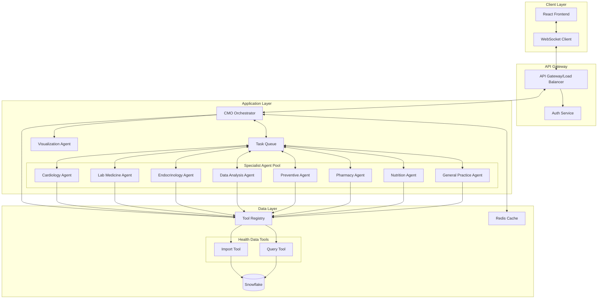
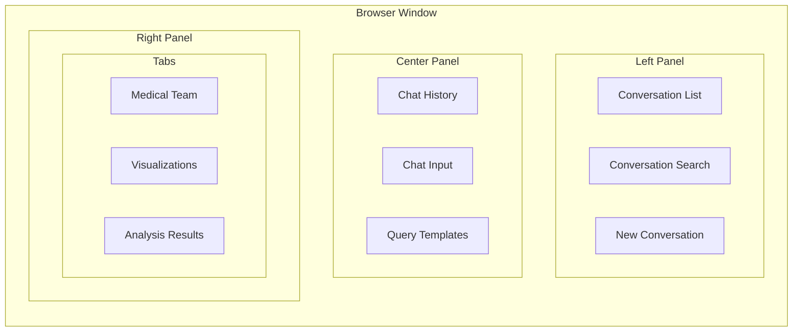
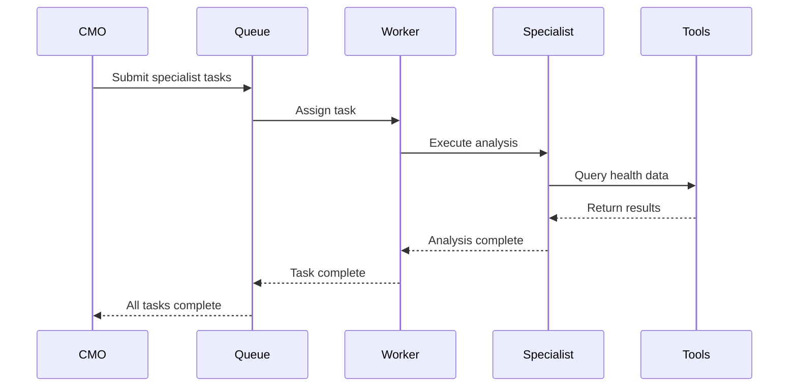
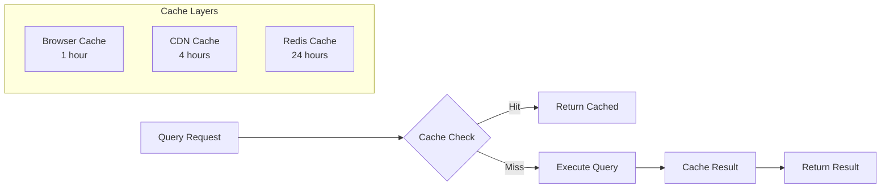
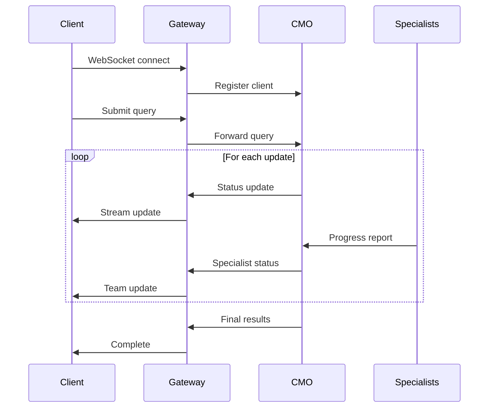
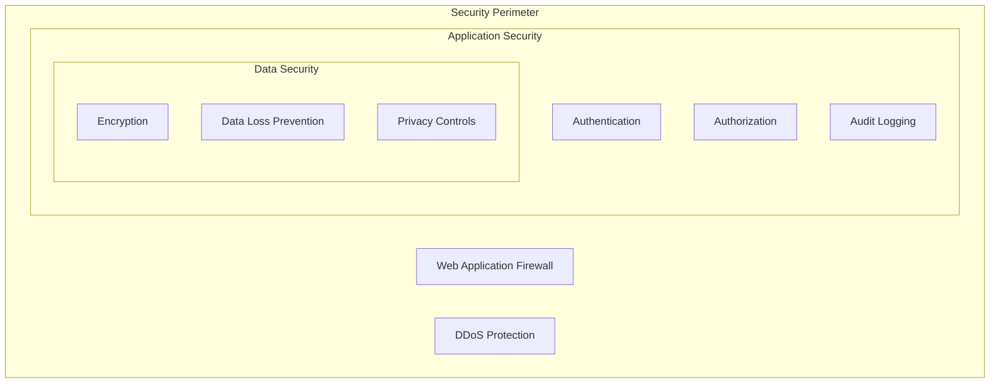
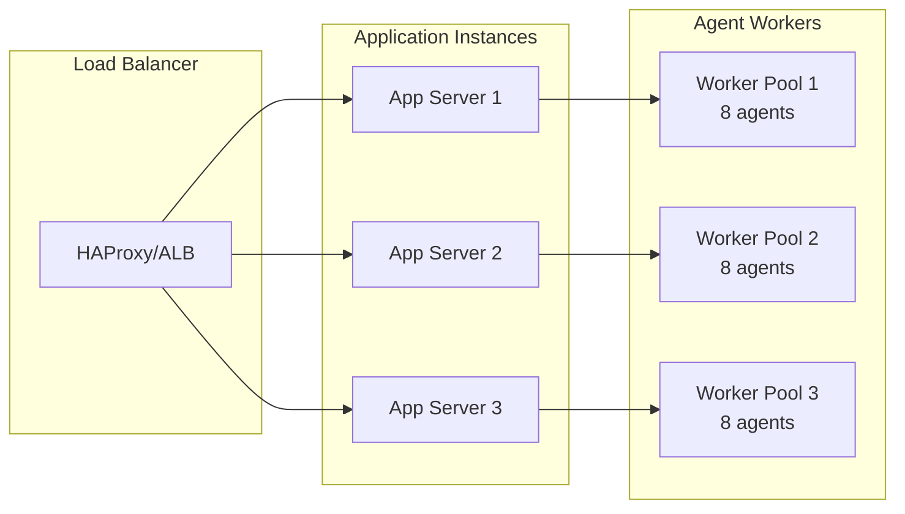
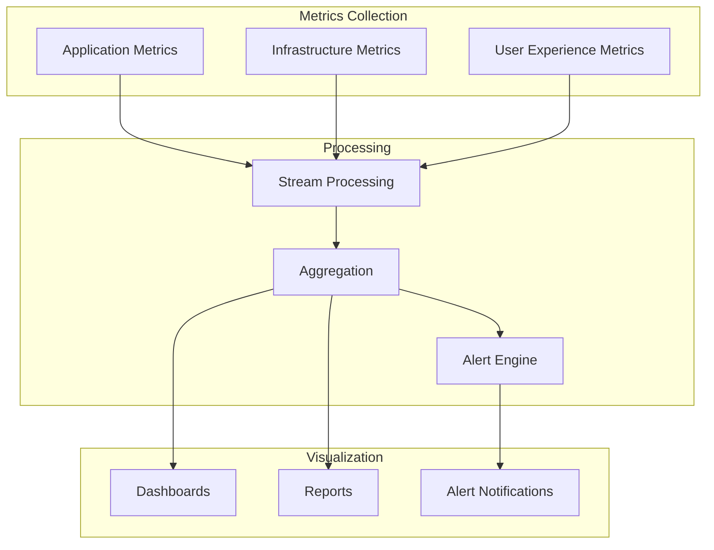
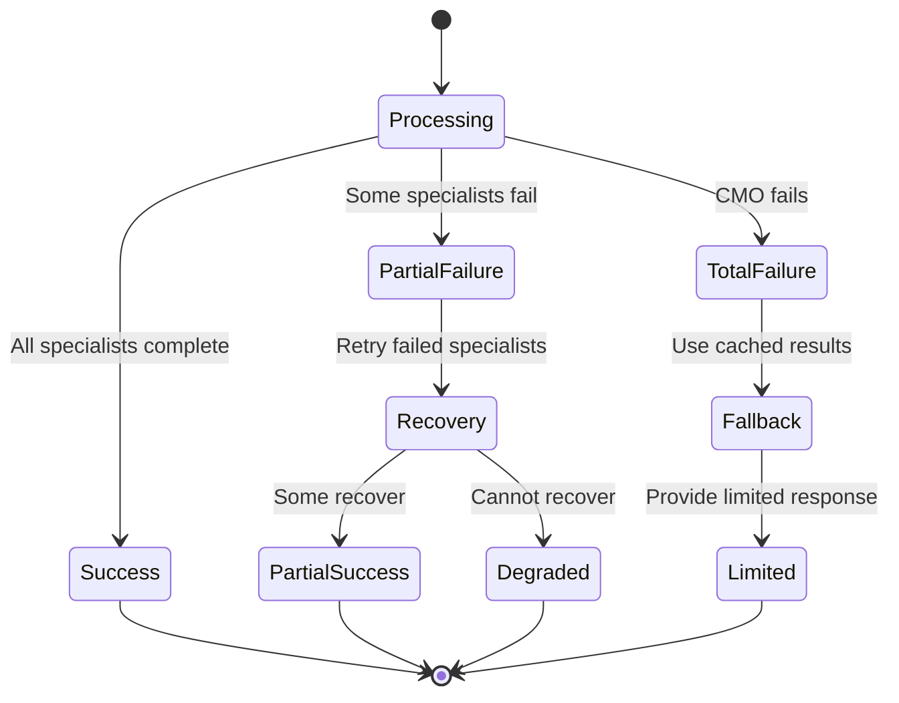
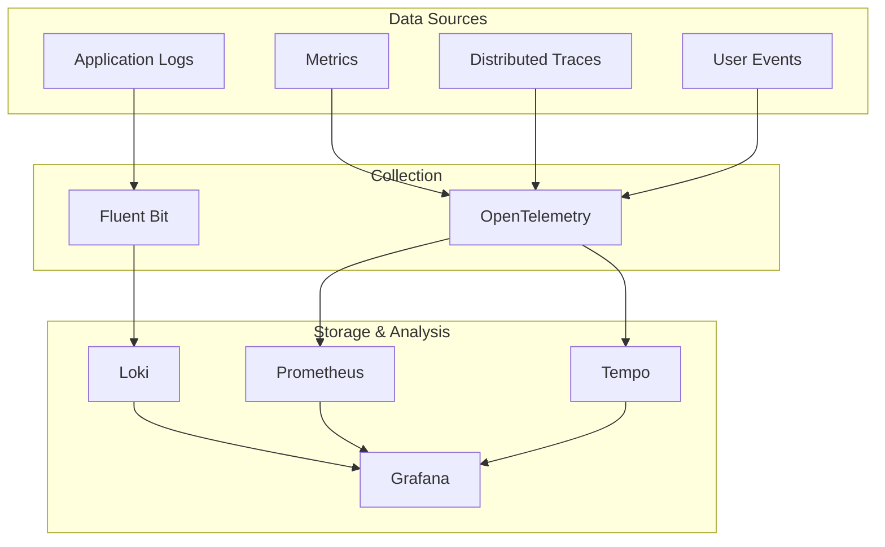

# Technical Architecture: Multi-Agent Health Insight System

## System Overview

The Multi-Agent Health Insight System implements a sophisticated orchestrator-worker pattern inspired by Anthropic's research, achieving 90.2% better performance than single-agent systems for complex health analysis tasks. The architecture prioritizes real-time responsiveness, parallel processing, and graceful error handling.

## High-Level Architecture



## Component Architecture

### 1. Client Layer

#### React Frontend
- **Framework**: Next.js 14 with App Router
- **State Management**: Zustand for global state, React Query for server state
- **UI Components**: Custom component library with Tailwind CSS
- **Real-time Updates**: Socket.io client for SSE fallback
- **Visualization**: Recharts for charts, custom React components

#### Three-Panel Layout


### 2. API Gateway Layer

#### Gateway Responsibilities
- Request routing and load balancing
- Authentication and authorization
- Rate limiting and throttling
- Request/response transformation
- WebSocket upgrade handling
- SSL termination

#### Authentication Service
- JWT-based authentication
- OAuth2 integration support
- Session management
- Permission-based access control
- API key management for external integrations

### 3. Application Layer

#### CMO Orchestrator

The Chief Medical Officer (CMO) is the central orchestrator implementing the pattern from Anthropic's research:

```python
class CMOOrchestrator:
    def __init__(self):
        self.specialist_registry = SpecialistRegistry()
        self.task_queue = TaskQueue()
        self.tool_registry = ToolRegistry()
    
    async def process_query(self, query: HealthQuery) -> HealthInsight:
        # 1. Analyze query complexity
        complexity = self.assess_complexity(query)
        
        # 2. Initial data assessment
        initial_data = await self.tool_registry.execute_tool(
            "execute_health_query_v2",
            {"query": self.create_assessment_query(query)}
        )
        
        # 3. Assemble specialist team
        specialists = self.select_specialists(query, complexity, initial_data)
        
        # 4. Create parallel tasks
        tasks = self.create_specialist_tasks(specialists, query, initial_data)
        
        # 5. Execute with real-time updates
        results = await self.execute_with_updates(tasks)
        
        # 6. Synthesize findings
        synthesis = self.synthesize_results(results)
        
        # 7. Generate visualizations if needed
        if complexity in [QueryComplexity.STANDARD, QueryComplexity.COMPLEX]:
            synthesis.visualization = await self.generate_visualization(synthesis)
        
        return synthesis
```

#### Specialist Agent Architecture

Each specialist agent follows a consistent pattern:

```python
class SpecialistAgent(ABC):
    def __init__(self, specialty: str):
        self.specialty = specialty
        self.tool_registry = ToolRegistry()
        self.confidence_threshold = 0.7
    
    @abstractmethod
    async def analyze(self, context: AnalysisContext) -> SpecialistResult:
        """Perform domain-specific analysis"""
        pass
    
    async def execute_query(self, query: str) -> QueryResult:
        """Execute health data query using tools"""
        return await self.tool_registry.execute_tool(
            "execute_health_query_v2",
            {"query": query}
        )
```

#### Task Queue System



### 4. Data Layer

#### Tool Registry Pattern

The Tool Registry provides a unified interface for all data operations:

```python
class ToolRegistry:
    def __init__(self):
        self.tools = {
            "snowflake_import_analyze_health_records_v2": ImportTool(),
            "execute_health_query_v2": QueryTool()
        }
    
    def get_tool_definitions(self) -> List[Dict[str, Any]]:
        """Returns tool definitions in Anthropic's format"""
        return [tool.get_definition() for tool in self.tools.values()]
    
    async def execute_tool(self, tool_name: str, parameters: Dict) -> Dict:
        """Executes a tool with given parameters"""
        tool = self.tools.get(tool_name)
        if not tool:
            raise ToolNotFoundError(f"Tool {tool_name} not found")
        
        return await tool.execute(**parameters)
```

#### Caching Strategy



### 5. Real-Time Communication

#### WebSocket Architecture



## Security Architecture

### Data Protection

1. **Encryption**
   - TLS 1.3 for all client connections
   - AES-256 for data at rest
   - End-to-end encryption for health data

2. **Access Control**
   - Role-based access control (RBAC)
   - Attribute-based access control (ABAC) for fine-grained permissions
   - API key rotation every 90 days

3. **Audit & Compliance**
   - Complete audit trail for all data access
   - HIPAA compliance logging
   - Data retention policies

### Security Layers



## Scalability Architecture

### Horizontal Scaling Strategy

1. **Stateless Services**
   - All application services are stateless
   - Session state stored in Redis
   - Enables easy horizontal scaling

2. **Agent Pool Scaling**
   - Dynamic worker pool based on queue depth
   - Auto-scaling based on CPU and memory metrics
   - Specialist agents scale independently

3. **Database Scaling**
   - Snowflake auto-scaling for compute
   - Read replicas for query distribution
   - Partition strategy for time-series data

### Load Distribution



## Performance Optimization

### Query Optimization Pipeline

1. **Query Classification**
   - Pattern matching for common queries
   - Complexity scoring algorithm
   - Automatic routing to fast/slow paths

2. **Caching Strategy**
   - Result caching for identical queries
   - Partial result caching for complex queries
   - Semantic similarity caching

3. **Resource Management**
   - Token budget per query complexity
   - Specialist timeout management
   - Circuit breaker for failing services

### Performance Monitoring



## Error Handling & Recovery

### Fault Tolerance Patterns

1. **Circuit Breaker**
   - Prevents cascade failures
   - Automatic recovery detection
   - Graceful degradation

2. **Retry Logic**
   - Exponential backoff for transient failures
   - Maximum retry limits
   - Dead letter queue for persistent failures

3. **Bulkhead Pattern**
   - Isolate specialist failures
   - Prevent total system failure
   - Maintain partial functionality

### Error Recovery Flow



## Deployment Architecture

### Container Orchestration

```yaml
# Kubernetes Deployment Example
apiVersion: apps/v1
kind: Deployment
metadata:
  name: health-insight-cmo
spec:
  replicas: 3
  selector:
    matchLabels:
      app: cmo-orchestrator
  template:
    metadata:
      labels:
        app: cmo-orchestrator
    spec:
      containers:
      - name: cmo
        image: health-insight/cmo:latest
        resources:
          requests:
            memory: "2Gi"
            cpu: "1000m"
          limits:
            memory: "4Gi"
            cpu: "2000m"
```

### CI/CD Pipeline

```mermaid
graph LR
    subgraph "Development"
        Code[Code Commit]
        Test[Unit Tests]
        Lint[Linting]
    end
    
    subgraph "Build"
        Build[Docker Build]
        Scan[Security Scan]
        Push[Registry Push]
    end
    
    subgraph "Deploy"
        Stage[Staging Deploy]
        E2E[E2E Tests]
        Prod[Production Deploy]
    end
    
    Code --> Test
    Test --> Lint
    Lint --> Build
    Build --> Scan
    Scan --> Push
    Push --> Stage
    Stage --> E2E
    E2E --> Prod
```

## Technology Stack

### Frontend
- **Framework**: Next.js 14
- **Language**: TypeScript
- **Styling**: Tailwind CSS
- **State**: Zustand + React Query
- **Charts**: Recharts
- **Real-time**: Socket.io-client

### Backend
- **Runtime**: Python 3.11+ with asyncio
- **Framework**: FastAPI
- **Queue**: Celery with Redis
- **Cache**: Redis
- **Monitoring**: Prometheus + Grafana

### Infrastructure
- **Container**: Docker
- **Orchestration**: Kubernetes
- **Load Balancer**: AWS ALB / HAProxy
- **CDN**: CloudFlare
- **Database**: Snowflake (via tools)

### AI/ML
- **LLM**: Anthropic Claude API
- **Embeddings**: OpenAI Ada (for semantic search)
- **Vector Store**: Pinecone (future)

## Monitoring & Observability

### Key Metrics

1. **System Health**
   - API response times (P50, P95, P99)
   - Error rates by endpoint
   - WebSocket connection stability
   - Queue depth and processing time

2. **Agent Performance**
   - Specialist completion rates
   - Token usage per specialist
   - Confidence score distribution
   - Failure rates by specialist type

3. **User Experience**
   - Time to first byte (TTFB)
   - Query completion times
   - Visualization render times
   - User satisfaction scores

### Observability Stack

