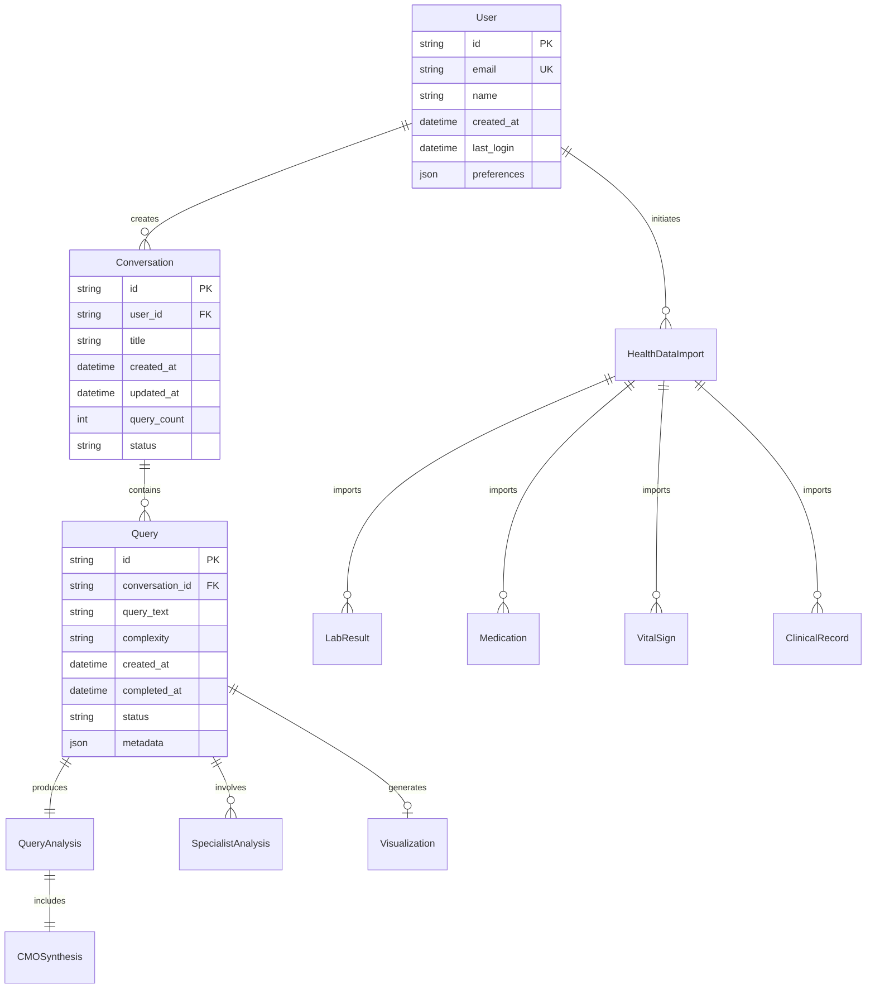

# Data Model Documentation: Multi-Agent Health Insight System

## Overview

This document defines the data models used throughout the Multi-Agent Health Insight System. All models are designed to support both real-time processing and historical analysis while maintaining HIPAA compliance.

## Entity Relationship Diagram



## Core Entities

### User

The authenticated user who owns health data and conversations.

```typescript
interface User {
  id: string;                    // Unique identifier (UUID)
  email: string;                 // Email address (unique)
  name: string;                  // Full name
  created_at: DateTime;          // Account creation timestamp
  last_login: DateTime;          // Last login timestamp
  preferences: UserPreferences;  // User settings
  metadata: {
    timezone: string;           // User's timezone
    locale: string;             // Preferred language/locale
    notification_settings: NotificationSettings;
  };
}

interface UserPreferences {
  theme: 'light' | 'dark' | 'auto';
  measurement_units: 'metric' | 'imperial';
  default_date_range: 'all' | '1y' | '5y' | '10y';
  privacy_settings: {
    share_anonymous_data: boolean;
    allow_research_use: boolean;
  };
}
```

### Conversation

A thread of related health queries maintaining context.

```typescript
interface Conversation {
  id: string;                    // Unique identifier
  user_id: string;               // Owner user ID
  title: string;                 // Auto-generated or user-defined
  created_at: DateTime;          // Creation timestamp
  updated_at: DateTime;          // Last activity timestamp
  query_count: number;           // Number of queries
  status: ConversationStatus;    // Current status
  metadata: {
    auto_title: boolean;         // Whether title was auto-generated
    primary_topics: string[];    // Main health topics discussed
    complexity_distribution: {
      simple: number;
      standard: number;
      complex: number;
      critical: number;
    };
  };
}

type ConversationStatus = 'active' | 'archived' | 'deleted';
```

### Query

An individual health question submitted by the user.

```typescript
interface Query {
  id: string;                    // Unique identifier
  conversation_id: string;       // Parent conversation
  query_text: string;            // Original user query
  complexity: QueryComplexity;   // Assessed complexity
  created_at: DateTime;          // Submission timestamp
  started_at?: DateTime;         // Processing start time
  completed_at?: DateTime;       // Completion timestamp
  status: QueryStatus;           // Current status
  context: QueryContext;         // Query context
  metadata: {
    token_count: number;         // Total tokens used
    processing_time_ms: number;  // Total processing time
    retry_count: number;         // Number of retries
    error_details?: ErrorInfo;   // Error information if failed
  };
}

type QueryComplexity = 'simple' | 'standard' | 'complex' | 'critical';
type QueryStatus = 'pending' | 'processing' | 'completed' | 'failed' | 'partial';

interface QueryContext {
  include_visualizations: boolean;
  priority: 'normal' | 'high';
  previous_query_ids: string[];  // For context preservation
  user_specified_timeframe?: string;
  focus_areas?: string[];        // Specific health domains to focus on
}
```

### QueryAnalysis

The complete analysis result for a query.

```typescript
interface QueryAnalysis {
  query_id: string;              // Associated query
  cmo_assessment: CMOAssessment; // Initial CMO analysis
  medical_team: MedicalTeam;     // Assembled team
  specialists_results: SpecialistAnalysis[];
  cmo_synthesis: CMOSynthesis;   // Final synthesis
  visualization?: VisualizationData;
  confidence_score: number;      // Overall confidence (0-1)
  metadata: {
    total_specialists: number;
    successful_specialists: number;
    failed_specialists: string[];
    consensus_level: 'high' | 'medium' | 'low';
  };
}

interface CMOAssessment {
  complexity_reasoning: string;
  initial_findings: string[];
  required_specialists: string[];
  estimated_completion_time: number;
  priority_level: number;
}
```

### MedicalTeam

The team of specialists assembled for a query.

```typescript
interface MedicalTeam {
  query_id: string;
  cmo: {
    id: 'cmo';
    name: 'Dr. Vitality';
    status: AgentStatus;
  };
  specialists: TeamSpecialist[];
  assembly_timestamp: DateTime;
  team_size: number;
}

interface TeamSpecialist {
  id: string;                    // Specialist type ID
  name: string;                  // Display name (e.g., "Dr. Heart")
  specialty: string;             // Medical specialty
  status: AgentStatus;           // Current status
  assigned_tasks: string[];      // Specific analysis tasks
  dependencies?: string[];       // Other specialists this depends on
}

type AgentStatus = 'waiting' | 'active' | 'completed' | 'failed';
```

### SpecialistAnalysis

Individual specialist's analysis results.

```typescript
interface SpecialistAnalysis {
  id: string;                    // Analysis ID
  query_id: string;              // Associated query
  specialist_id: string;         // Specialist type
  specialist_name: string;       // Display name
  started_at: DateTime;          // Start timestamp
  completed_at: DateTime;        // Completion timestamp
  status: 'completed' | 'failed' | 'partial';
  confidence: number;            // Confidence score (0-1)
  findings: SpecialistFindings;
  tool_calls: ToolCall[];        // Data retrieval calls made
  metadata: {
    tokens_used: number;
    processing_time_ms: number;
    data_points_analyzed: number;
  };
}

interface SpecialistFindings {
  summary: string;               // Brief summary
  key_points: string[];          // Bullet points
  detailed_analysis?: string;    // Full analysis
  metrics?: HealthMetric[];      // Specific health metrics
  recommendations?: string[];    // Specialist-specific recommendations
  concerns?: HealthConcern[];    // Identified concerns
  correlations?: Correlation[];  // Found correlations
}

interface HealthMetric {
  name: string;
  value: number | string;
  unit?: string;
  reference_range?: string;
  status: 'normal' | 'abnormal' | 'critical';
  trend?: 'improving' | 'stable' | 'worsening';
}
```

### CMOSynthesis

The final synthesized analysis from the CMO.

```typescript
interface CMOSynthesis {
  query_id: string;
  summary: string;                // Executive summary
  key_findings: KeyFinding[];     // Primary discoveries
  recommendations: Recommendation[];
  areas_of_concern: AreaOfConcern[];
  confidence_level: number;       // Overall confidence
  consensus_notes?: string;       // Notes on specialist agreement
  follow_up_suggestions: string[]; // Suggested follow-up queries
  metadata: {
    synthesis_method: 'consensus' | 'weighted' | 'priority';
    conflicting_findings: boolean;
    data_completeness: number;    // 0-1 score
  };
}

interface KeyFinding {
  category: string;              // Health category
  finding: string;               // The finding
  importance: 'critical' | 'high' | 'medium' | 'low';
  supporting_specialists: string[]; // Which specialists support this
  evidence_strength: number;     // 0-1 score
}

interface Recommendation {
  type: 'action' | 'monitoring' | 'consultation' | 'lifestyle';
  recommendation: string;
  priority: 'immediate' | 'soon' | 'routine';
  rationale: string;
  relevant_metrics?: string[];
}
```

### Visualization

Dynamic visualization data for health insights.

```typescript
interface VisualizationData {
  id: string;
  query_id: string;
  type: VisualizationType;
  title: string;
  component_code: string;        // React component code
  data: ChartData;               // Structured chart data
  config: VisualizationConfig;
  created_at: DateTime;
  metadata: {
    data_points: number;
    time_range?: DateRange;
    refresh_rate?: number;       // For real-time data
  };
}

type VisualizationType = 
  | 'time_series'
  | 'comparison'
  | 'distribution'
  | 'correlation_matrix'
  | 'dashboard';

interface ChartData {
  datasets: Dataset[];
  labels?: string[];
  axes?: AxisConfig[];
}

interface VisualizationConfig {
  interactive: boolean;
  exportable: boolean;
  responsive: boolean;
  theme: 'light' | 'dark' | 'auto';
  color_scheme: string[];
  annotations?: Annotation[];
}
```

## Health Data Models

### LabResult

Laboratory test results with reference ranges.

```typescript
interface LabResult {
  id: string;
  user_id: string;
  import_id: string;              // Import batch ID
  test_date: DateTime;
  test_name: string;
  value: number | string;
  unit?: string;
  reference_range?: string;
  reference_low?: number;
  reference_high?: number;
  status: 'normal' | 'abnormal' | 'critical';
  category: LabCategory;
  metadata: {
    lab_name?: string;
    ordering_provider?: string;
    collection_method?: string;
    fasting_status?: boolean;
    notes?: string;
  };
}

type LabCategory = 
  | 'blood_chemistry'
  | 'hematology'
  | 'hormones'
  | 'vitamins_minerals'
  | 'inflammatory_markers'
  | 'metabolic'
  | 'cardiac_markers'
  | 'liver_function'
  | 'kidney_function';
```

### Medication

Medication prescriptions and adherence data.

```typescript
interface Medication {
  id: string;
  user_id: string;
  import_id: string;
  drug_name: string;
  generic_name?: string;
  dosage: string;
  frequency: string;
  route: string;                  // oral, injection, etc.
  start_date: DateTime;
  end_date?: DateTime;
  status: 'active' | 'completed' | 'discontinued';
  prescribed_by?: string;
  adherence_data?: AdherenceData;
  metadata: {
    indication?: string;          // Why prescribed
    pharmacy?: string;
    refills_remaining?: number;
    side_effects_reported?: string[];
    drug_class?: string;
    interactions_checked?: boolean;
  };
}

interface AdherenceData {
  adherence_percentage: number;
  missed_doses: number;
  late_doses: number;
  measurement_period_days: number;
  last_taken?: DateTime;
}
```

### VitalSign

Vital signs measurements over time.

```typescript
interface VitalSign {
  id: string;
  user_id: string;
  import_id: string;
  measurement_date: DateTime;
  vital_type: VitalType;
  value: number | VitalMeasurement;
  unit: string;
  source: 'manual' | 'device' | 'clinical';
  metadata: {
    device_name?: string;
    measurement_position?: string; // sitting, standing, etc.
    measurement_arm?: 'left' | 'right';
    notes?: string;
    irregular_heartbeat?: boolean;
  };
}

type VitalType = 
  | 'blood_pressure'
  | 'heart_rate'
  | 'temperature'
  | 'weight'
  | 'height'
  | 'bmi'
  | 'oxygen_saturation'
  | 'respiratory_rate';

interface VitalMeasurement {
  systolic?: number;              // For blood pressure
  diastolic?: number;             // For blood pressure
  pulse?: number;                 // Associated pulse
}
```

### ClinicalRecord

Diagnoses, procedures, and other clinical data.

```typescript
interface ClinicalRecord {
  id: string;
  user_id: string;
  import_id: string;
  record_type: ClinicalRecordType;
  date: DateTime;
  description: string;
  code?: string;                  // ICD-10, CPT, etc.
  code_system?: string;
  provider?: string;
  facility?: string;
  status: 'active' | 'resolved' | 'chronic';
  metadata: {
    severity?: 'mild' | 'moderate' | 'severe';
    onset_date?: DateTime;
    resolution_date?: DateTime;
    related_records?: string[];   // Related record IDs
    notes?: string;
  };
}

type ClinicalRecordType = 
  | 'diagnosis'
  | 'procedure'
  | 'allergy'
  | 'immunization'
  | 'family_history'
  | 'social_history';
```

### HealthDataImport

Track health data import operations.

```typescript
interface HealthDataImport {
  id: string;
  user_id: string;
  import_date: DateTime;
  status: ImportStatus;
  source: 'manual' | 'ehr_export' | 'device_sync' | 'api';
  files_processed: FileInfo[];
  summary: ImportSummary;
  metadata: {
    import_duration_seconds: number;
    validation_errors?: ValidationError[];
    duplicate_handling: 'skip' | 'update' | 'version';
  };
}

type ImportStatus = 'pending' | 'processing' | 'completed' | 'failed' | 'partial';

interface ImportSummary {
  total_records: number;
  records_by_type: Record<string, number>;
  date_range: DateRange;
  data_quality_score: number;
  new_records: number;
  updated_records: number;
  skipped_records: number;
}
```

## Validation Rules

### Required Fields
- All entities must have unique `id` fields
- User-associated entities must have valid `user_id`
- Timestamps must be in ISO 8601 format
- Status fields must use predefined enums

### Data Constraints

1. **Lab Results**
   - Value must be numeric for quantitative tests
   - Reference ranges must be parseable
   - Test date cannot be in the future

2. **Medications**
   - Start date required
   - Dosage must follow standard format
   - Frequency must be parseable

3. **Vital Signs**
   - Blood pressure requires both systolic and diastolic
   - Values must be within reasonable ranges
   - Measurement date cannot be in the future

4. **Queries**
   - Query text minimum 10 characters
   - Maximum 1000 characters
   - Must be in supported language

## Example Data

### Sample Lab Result
```json
{
  "id": "lab_123",
  "user_id": "user_456",
  "import_id": "imp_789",
  "test_date": "2024-06-15T08:30:00Z",
  "test_name": "Total Cholesterol",
  "value": 185,
  "unit": "mg/dL",
  "reference_range": "< 200",
  "reference_high": 200,
  "status": "normal",
  "category": "blood_chemistry",
  "metadata": {
    "lab_name": "Quest Diagnostics",
    "ordering_provider": "Dr. Smith",
    "fasting_status": true
  }
}
```

### Sample Query with Analysis
```json
{
  "id": "qry_456",
  "conversation_id": "conv_789",
  "query_text": "What's my cholesterol trend over the last 15 years?",
  "complexity": "standard",
  "created_at": "2025-01-15T10:30:00Z",
  "completed_at": "2025-01-15T10:32:45Z",
  "status": "completed",
  "context": {
    "include_visualizations": true,
    "priority": "normal",
    "previous_query_ids": []
  },
  "metadata": {
    "token_count": 4532,
    "processing_time_ms": 165000,
    "retry_count": 0
  }
}
```

## Data Privacy & Security

### Encryption
- All PII fields encrypted at rest using AES-256
- Health data encrypted in transit using TLS 1.3
- Encryption keys rotated every 90 days

### Access Control
- Row-level security enforced at database level
- User can only access their own health data
- Audit log for all data access operations

### Data Retention
- Active data retained indefinitely
- Deleted conversations retained for 30 days
- Import logs retained for 1 year
- Audit logs retained for 7 years (HIPAA requirement)

### Anonymization
- Research exports strip all PII
- Analytics use hashed user IDs
- No PII in application logs