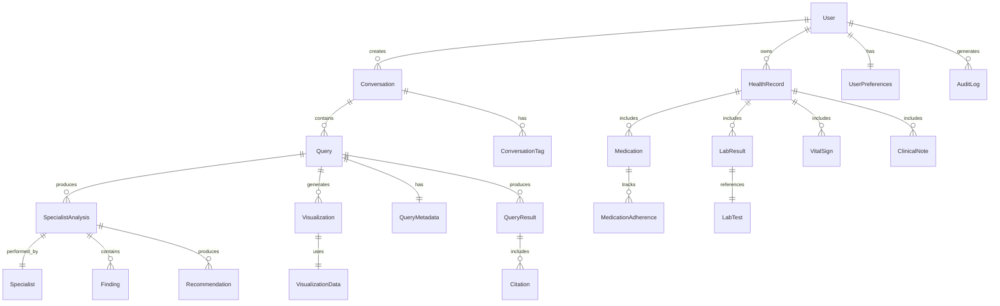

# Data Model Documentation: Multi-Agent Health Insight System

## Overview

This document defines the data models, entity relationships, and schemas used throughout the Multi-Agent Health Insight System. All models are designed to support HIPAA compliance, efficient querying, and extensibility.

## Entity Relationship Diagram



## Core Entities

### User
Represents a system user with their authentication and profile information.

```typescript
interface User {
  id: UUID;
  email: string;
  emailVerified: boolean;
  passwordHash: string; // bcrypt
  profile: {
    firstName: string;
    lastName: string;
    dateOfBirth?: Date; // For age-appropriate recommendations
    gender?: 'male' | 'female' | 'other' | 'prefer-not-to-say';
    timezone: string; // IANA timezone
  };
  authentication: {
    mfaEnabled: boolean;
    mfaSecret?: string; // Encrypted
    lastLogin: Date;
    loginCount: number;
    failedAttempts: number;
    lockedUntil?: Date;
  };
  subscription: {
    plan: 'free' | 'premium' | 'enterprise';
    status: 'active' | 'cancelled' | 'suspended';
    expiresAt?: Date;
  };
  metadata: {
    createdAt: Date;
    updatedAt: Date;
    deletedAt?: Date; // Soft delete
    lastActivityAt: Date;
  };
}

// Validation Rules
const UserValidation = {
  email: z.string().email().max(255),
  password: z.string().min(8).max(128)
    .regex(/^(?=.*[a-z])(?=.*[A-Z])(?=.*\d)(?=.*[@$!%*?&])/),
  firstName: z.string().min(1).max(100),
  lastName: z.string().min(1).max(100),
  dateOfBirth: z.date().max(new Date()).optional()
};
```

### Conversation
Groups related queries into a logical session.

```typescript
interface Conversation {
  id: UUID;
  userId: UUID;
  title: string;
  description?: string;
  status: 'active' | 'archived';
  metadata: {
    queryCount: number;
    lastQueryAt: Date;
    primaryTopics: string[]; // Auto-extracted
    createdAt: Date;
    updatedAt: Date;
  };
  settings: {
    autoTitle: boolean; // Auto-generate title from first query
    retention: 'default' | 'extended' | 'permanent';
  };
}

// Example Data
{
  "id": "550e8400-e29b-41d4-a716-446655440000",
  "userId": "user_123",
  "title": "Cholesterol Analysis - 15 Year Trend",
  "status": "active",
  "metadata": {
    "queryCount": 3,
    "lastQueryAt": "2024-01-15T10:30:00Z",
    "primaryTopics": ["cholesterol", "cardiovascular", "medications"],
    "createdAt": "2024-01-15T09:00:00Z",
    "updatedAt": "2024-01-15T10:30:00Z"
  }
}
```

### Query
Represents a single health query submitted by a user.

```typescript
interface Query {
  id: UUID;
  conversationId: UUID;
  userId: UUID;
  
  // Query Details
  query: string;
  normalizedQuery?: string; // Cleaned version for analysis
  complexity: 'simple' | 'standard' | 'complex' | 'critical';
  
  // Processing Status
  status: 'queued' | 'processing' | 'completed' | 'failed' | 'cancelled';
  progress: {
    overall: number; // 0-100
    phase: 'initialization' | 'analysis' | 'synthesis' | 'visualization';
    message?: string;
  };
  
  // Timing
  timing: {
    queuedAt: Date;
    startedAt?: Date;
    completedAt?: Date;
    processingTime?: number; // milliseconds
  };
  
  // Context
  context: {
    previousQueryId?: UUID;
    urgency: 'low' | 'normal' | 'high';
    preferences: {
      visualizations: boolean;
      detailLevel: 'summary' | 'standard' | 'comprehensive';
      language: string;
    };
  };
  
  // Results Reference
  resultSummary?: {
    keyFindings: number;
    specialistsUsed: string[];
    confidenceScore: number;
    hasVisualizations: boolean;
  };
}
```

### SpecialistAnalysis
Results from individual specialist agents.

```typescript
interface SpecialistAnalysis {
  id: UUID;
  queryId: UUID;
  specialistType: MedicalSpecialty;
  
  // Execution Details
  status: 'pending' | 'running' | 'completed' | 'failed';
  startedAt: Date;
  completedAt?: Date;
  executionTime?: number; // milliseconds
  
  // Task Details
  assignedTask: {
    description: string;
    priority: 'low' | 'normal' | 'high';
    requiredData: string[];
  };
  
  // Results
  findings: Finding[];
  recommendations: Recommendation[];
  confidence: number; // 0-1
  
  // Tool Usage
  toolCalls: {
    toolName: string;
    timestamp: Date;
    duration: number;
    success: boolean;
    resultSize: number;
  }[];
  
  // Metadata
  dataPointsAnalyzed: number;
  errorDetails?: {
    code: string;
    message: string;
    recoverable: boolean;
  };
}

interface Finding {
  id: UUID;
  analysisId: UUID;
  
  category: 'observation' | 'trend' | 'anomaly' | 'risk' | 'correlation';
  severity: 'info' | 'low' | 'medium' | 'high' | 'critical';
  
  description: string;
  evidence: {
    dataPoints: any[];
    timeRange?: { start: Date; end: Date };
    sources: string[];
  };
  
  confidence: number;
  clinicalRelevance: 'low' | 'moderate' | 'high';
}

interface Recommendation {
  id: UUID;
  analysisId: UUID;
  
  type: 'lifestyle' | 'medical' | 'monitoring' | 'further-testing';
  priority: 'low' | 'medium' | 'high' | 'urgent';
  
  title: string;
  description: string;
  rationale: string;
  
  actionable: boolean;
  timeframe?: 'immediate' | 'short-term' | 'long-term';
  
  references?: {
    guidelines?: string[];
    studies?: string[];
  };
}
```

### Health Data Models

#### LabResult
Laboratory test results with reference ranges.

```typescript
interface LabResult {
  id: UUID;
  userId: UUID;
  healthRecordId: UUID;
  
  // Test Information
  testName: string;
  testCode?: string; // LOINC code
  category: 'blood-chemistry' | 'hematology' | 'hormones' | 
            'vitamins' | 'inflammatory' | 'other';
  
  // Results
  value: number | string;
  unit: string;
  referenceRange?: {
    min?: number;
    max?: number;
    optimal?: { min: number; max: number };
    unit: string;
  };
  
  // Status
  status: 'normal' | 'abnormal-high' | 'abnormal-low' | 
          'critical-high' | 'critical-low';
  flagged: boolean;
  
  // Metadata
  collectionDate: Date;
  resultDate: Date;
  provider?: {
    name: string;
    facility: string;
    npi?: string;
  };
  
  // Notes
  labNotes?: string;
  clinicalNotes?: string;
  
  // Data Quality
  verified: boolean;
  source: 'ehr' | 'manual' | 'import';
  importId?: UUID;
}

// Example Data
{
  "id": "lab_001",
  "testName": "Total Cholesterol",
  "category": "blood-chemistry",
  "value": 185,
  "unit": "mg/dL",
  "referenceRange": {
    "max": 200,
    "optimal": { "min": 150, "max": 180 }
  },
  "status": "normal",
  "collectionDate": "2024-01-15T08:00:00Z"
}
```

#### Medication
Medication records with dosing and adherence tracking.

```typescript
interface Medication {
  id: UUID;
  userId: UUID;
  healthRecordId: UUID;
  
  // Drug Information
  name: string;
  genericName?: string;
  brandName?: string;
  rxNormCode?: string;
  drugClass?: string;
  
  // Dosing
  dosage: {
    strength: string; // "10 mg"
    form: 'tablet' | 'capsule' | 'liquid' | 'injection' | 'other';
    route: 'oral' | 'topical' | 'injection' | 'inhalation' | 'other';
    frequency: string; // "twice daily"
    instructions?: string;
  };
  
  // Timeline
  prescribedDate: Date;
  startDate: Date;
  endDate?: Date;
  status: 'active' | 'discontinued' | 'completed' | 'on-hold';
  
  // Prescriber
  prescriber?: {
    name: string;
    specialty?: string;
    npi?: string;
  };
  
  // Purpose
  indication?: string;
  diagnoses?: string[]; // ICD-10 codes
  
  // Adherence Tracking
  adherenceRate?: number; // 0-100
  lastRefillDate?: Date;
  nextRefillDate?: Date;
  missedDoses?: number;
}

interface MedicationAdherence {
  id: UUID;
  medicationId: UUID;
  
  date: Date;
  scheduled: boolean;
  taken: boolean;
  takenAt?: Date;
  
  dose?: {
    scheduled: string;
    actual?: string;
  };
  
  notes?: string;
  sideEffects?: string[];
}
```

#### VitalSign
Vital signs measurements.

```typescript
interface VitalSign {
  id: UUID;
  userId: UUID;
  healthRecordId: UUID;
  
  type: 'blood-pressure' | 'heart-rate' | 'temperature' | 
        'weight' | 'bmi' | 'respiratory-rate' | 'oxygen-saturation';
  
  // Measurements
  measurements: {
    systolic?: number;    // Blood pressure
    diastolic?: number;   // Blood pressure
    value?: number;       // Single value vitals
    unit: string;
  };
  
  // Context
  measurementDate: Date;
  measurementTime?: string; // Time of day
  context?: {
    position?: 'sitting' | 'standing' | 'lying';
    arm?: 'left' | 'right';
    activity?: 'rest' | 'post-exercise' | 'post-meal';
    device?: string;
  };
  
  // Classification
  status?: 'normal' | 'elevated' | 'high' | 'low' | 'critical';
  
  // Source
  source: 'clinical' | 'home' | 'device' | 'manual';
  verifiedBy?: string;
}
```

### QueryResult
Comprehensive results from multi-agent analysis.

```typescript
interface QueryResult {
  id: UUID;
  queryId: UUID;
  
  // Executive Summary
  summary: {
    brief: string; // 1-2 sentences
    detailed: string; // Full paragraph
    keyTakeaways: string[];
  };
  
  // Findings
  findings: {
    category: 'primary' | 'secondary' | 'incidental';
    findings: Finding[];
    totalCount: number;
  }[];
  
  // Recommendations
  recommendations: {
    immediate: Recommendation[];
    shortTerm: Recommendation[]; // 1-3 months
    longTerm: Recommendation[]; // 3+ months
  };
  
  // Visualizations
  visualizations: Visualization[];
  
  // Metadata
  metadata: {
    complexity: QueryComplexity;
    processingTime: number;
    specialistsUsed: {
      name: string;
      contributionScore: number; // 0-1
    }[];
    dataPointsAnalyzed: number;
    overallConfidence: number;
    limitations?: string[];
  };
  
  // Citations
  citations: Citation[];
}

interface Citation {
  id: UUID;
  resultId: UUID;
  
  text: string; // Text being cited
  source: {
    type: 'lab-result' | 'medication' | 'vital' | 'guideline' | 'analysis';
    id: UUID;
    name: string;
    date?: Date;
  };
  
  confidence: number;
  position: { start: number; end: number }; // Character positions
}
```

### Visualization
Interactive chart components.

```typescript
interface Visualization {
  id: UUID;
  queryId: UUID;
  
  // Visualization Details
  type: 'line' | 'bar' | 'scatter' | 'heatmap' | 'gauge' | 'combined';
  title: string;
  subtitle?: string;
  
  // Component
  component: {
    framework: 'react';
    version: string;
    code: string; // Base64 encoded
    dependencies: string[]; // Required libraries
  };
  
  // Data
  dataSchema: {
    xAxis: { field: string; type: 'date' | 'number' | 'category' };
    yAxis: { field: string; type: 'number' };
    series?: { name: string; field: string }[];
  };
  
  // Configuration
  config: {
    interactive: boolean;
    exportable: boolean;
    responsive: boolean;
    animations: boolean;
    features: ('zoom' | 'pan' | 'tooltip' | 'legend' | 'download')[];
  };
  
  // Metadata
  metadata: {
    dataPoints: number;
    timeRange?: { start: Date; end: Date };
    lastUpdated: Date;
    generatedBy: string; // Which specialist
  };
}

interface VisualizationData {
  id: UUID;
  visualizationId: UUID;
  
  data: any[]; // Actual data points
  
  // Caching
  cachedAt: Date;
  expiresAt: Date;
  compressionType?: 'gzip' | 'none';
  sizeBytes: number;
}
```

### UserPreferences
User-specific settings and preferences.

```typescript
interface UserPreferences {
  userId: UUID;
  
  // Display Preferences
  display: {
    theme: 'light' | 'dark' | 'auto';
    fontSize: 'small' | 'medium' | 'large';
    colorScheme: 'default' | 'high-contrast' | 'colorblind-safe';
    animations: boolean;
    compactMode: boolean;
  };
  
  // Analysis Preferences
  analysis: {
    defaultComplexity: 'auto' | 'simple' | 'comprehensive';
    autoVisualization: boolean;
    preferredSpecialists?: string[];
    detailLevel: 'summary' | 'standard' | 'detailed';
    medicalTerminology: 'layman' | 'basic' | 'technical';
  };
  
  // Notification Preferences
  notifications: {
    email: {
      enabled: boolean;
      frequency: 'immediate' | 'daily' | 'weekly';
      types: {
        analysisComplete: boolean;
        newInsights: boolean;
        healthAlerts: boolean;
        systemUpdates: boolean;
      };
    };
    push: {
      enabled: boolean;
      types: Record<string, boolean>;
    };
  };
  
  // Privacy Settings
  privacy: {
    shareAnonymousData: boolean;
    allowResearch: boolean;
    dataRetention: '6months' | '1year' | '2years' | 'forever';
    exportFormat: 'json' | 'csv' | 'pdf';
  };
  
  // Accessibility
  accessibility: {
    screenReader: boolean;
    keyboardNavigation: boolean;
    reduceMotion: boolean;
    highContrastMode: boolean;
  };
  
  updatedAt: Date;
}
```

### AuditLog
Comprehensive audit trail for compliance.

```typescript
interface AuditLog {
  id: UUID;
  timestamp: Date;
  
  // Actor
  userId?: UUID;
  systemComponent?: string;
  ipAddress?: string; // Hashed
  userAgent?: string;
  
  // Action
  action: {
    category: 'auth' | 'data-access' | 'data-modify' | 
              'query' | 'export' | 'admin';
    type: string; // Specific action
    description: string;
  };
  
  // Target
  target: {
    type: 'user' | 'health-record' | 'query' | 'system';
    id?: UUID;
    name?: string;
  };
  
  // Result
  result: {
    success: boolean;
    errorCode?: string;
    duration?: number;
  };
  
  // Compliance
  compliance: {
    hipaa: boolean;
    dataAccessed?: string[]; // Types of PHI accessed
    justification?: string;
  };
  
  // Metadata
  metadata?: Record<string, any>;
  retentionDate: Date; // When this log can be deleted
}
```

## Data Validation Schemas

### Query Validation
```typescript
const QuerySchema = z.object({
  query: z.string().min(5).max(1000),
  context: z.object({
    conversationId: z.string().uuid().optional(),
    previousQueryId: z.string().uuid().optional(),
    urgency: z.enum(['low', 'normal', 'high']).default('normal')
  }).optional(),
  preferences: z.object({
    visualizations: z.boolean().default(true),
    detailLevel: z.enum(['summary', 'standard', 'comprehensive'])
      .default('standard'),
    language: z.string().length(2).default('en')
  }).optional()
});
```

### Health Data Import Validation
```typescript
const HealthDataImportSchema = z.object({
  labResults: z.array(z.object({
    testName: z.string(),
    value: z.union([z.number(), z.string()]),
    unit: z.string(),
    collectionDate: z.string().datetime(),
    referenceRange: z.object({
      min: z.number().optional(),
      max: z.number().optional()
    }).optional()
  })).optional(),
  
  medications: z.array(z.object({
    name: z.string(),
    dosage: z.string(),
    frequency: z.string(),
    startDate: z.string().datetime(),
    endDate: z.string().datetime().optional()
  })).optional(),
  
  vitals: z.array(z.object({
    type: z.enum(['blood-pressure', 'heart-rate', 'weight']),
    value: z.number().optional(),
    systolic: z.number().optional(),
    diastolic: z.number().optional(),
    measurementDate: z.string().datetime()
  })).optional()
});
```

## Indexing Strategy

### Primary Indexes
```sql
-- User queries
CREATE INDEX idx_query_user_conversation ON queries(user_id, conversation_id);
CREATE INDEX idx_query_status_created ON queries(status, created_at);

-- Health records
CREATE INDEX idx_lab_user_date ON lab_results(user_id, collection_date DESC);
CREATE INDEX idx_lab_test_name ON lab_results(test_name, user_id);

-- Specialist analysis
CREATE INDEX idx_analysis_query ON specialist_analyses(query_id);
CREATE INDEX idx_analysis_specialist ON specialist_analyses(specialist_type, status);

-- Audit trail
CREATE INDEX idx_audit_user_time ON audit_logs(user_id, timestamp);
CREATE INDEX idx_audit_action_time ON audit_logs(action_category, timestamp);
```

### Full-Text Search Indexes
```sql
-- For searching queries
CREATE INDEX idx_query_text ON queries USING gin(to_tsvector('english', query));

-- For searching findings
CREATE INDEX idx_finding_text ON findings USING gin(to_tsvector('english', description));
```

## Data Retention Policies

### Retention Rules
1. **User Data**: Retained until account deletion + 30 days
2. **Health Records**: Retained per user preference (min 7 years for compliance)
3. **Queries**: Active for 2 years, then archived
4. **Audit Logs**: 7 years (HIPAA requirement)
5. **Temporary Data**: 24 hours (caches, incomplete analyses)

### Deletion Procedures
```typescript
interface DeletionPolicy {
  softDelete: boolean; // Mark as deleted vs. hard delete
  anonymize: boolean; // Replace PII with anonymous identifiers
  cascadeDelete: string[]; // Related entities to delete
  retentionPeriod: number; // Days to retain after soft delete
  complianceHold?: boolean; // Prevent deletion for legal reasons
}
```

## Security Considerations

### Encryption
- **At Rest**: AES-256 for all PHI
- **In Transit**: TLS 1.3 minimum
- **Field Level**: Sensitive fields individually encrypted

### Access Control
```typescript
interface DataAccessPolicy {
  entity: string;
  permissions: {
    read: boolean;
    write: boolean;
    delete: boolean;
  };
  conditions?: {
    ownDataOnly?: boolean;
    timeRestriction?: { start: string; end: string };
    ipWhitelist?: string[];
  };
  audit: {
    required: boolean;
    level: 'basic' | 'detailed';
  };
}
```

### Data Masking
```typescript
interface MaskingRule {
  field: string;
  method: 'full' | 'partial' | 'hash' | 'tokenize';
  showLastN?: number; // For partial masking
  authorizedRoles?: string[]; // Who can see unmasked
}
```