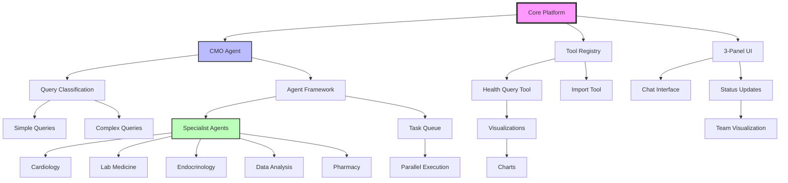

# Feature Prioritization Matrix: Multi-Agent Health Insight System

## Overview

This matrix prioritizes features based on user impact, development effort, and strategic value. Features are categorized using the MoSCoW method (Must have, Should have, Could have, Won't have) and assigned to development phases.

## Prioritization Criteria

- **User Impact**: How much value does this deliver to users? (High/Medium/Low)
- **Development Effort**: How complex is implementation? (High/Medium/Low)
- **Priority**: P0 (Critical), P1 (Important), P2 (Nice to have)
- **Dependencies**: What must be built first?
- **MVP Inclusion**: Is this required for initial launch?

## Feature Priority Matrix

### Core Platform Features

| Feature | User Impact | Dev Effort | Priority | Dependencies | MVP | Phase |
|---------|------------|------------|----------|--------------|-----|-------|
| **Multi-Agent Orchestration** ||||||| 
| CMO Agent (Orchestrator) | High | Medium | P0 | None | Yes | 1 |
| Specialist Agent Framework | High | High | P0 | CMO Agent | Yes | 1 |
| Agent Communication Protocol | High | Medium | P0 | Agent Framework | Yes | 1 |
| Task Queue System | High | Medium | P0 | None | Yes | 1 |
| Parallel Execution Engine | High | High | P0 | Task Queue | Yes | 1 |
| **Health Data Integration** ||||||| 
| Tool Registry Implementation | High | Low | P0 | None | Yes | 1 |
| Health Query Tool Integration | High | Medium | P0 | Tool Registry | Yes | 1 |
| Data Import Tool Integration | High | Medium | P0 | Tool Registry | Yes | 1 |
| Query Result Caching | Medium | Medium | P1 | Query Tool | No | 2 |
| **User Interface** ||||||| 
| 3-Panel Layout | High | Medium | P0 | None | Yes | 1 |
| Chat Interface | High | Medium | P0 | 3-Panel Layout | Yes | 1 |
| Real-time Status Updates (SSE) | High | High | P0 | Agent Framework | Yes | 1 |
| Medical Team Visualization | High | Medium | P0 | Status Updates | Yes | 1 |
| Query Selector UI | Medium | Low | P1 | Chat Interface | Yes | 1 |

### Specialist Agents

| Feature | User Impact | Dev Effort | Priority | Dependencies | MVP | Phase |
|---------|------------|------------|----------|--------------|-----|-------|
| Cardiology Specialist | High | Medium | P0 | Agent Framework | Yes | 1 |
| Laboratory Medicine Specialist | High | Medium | P0 | Agent Framework | Yes | 1 |
| Endocrinology Specialist | High | Medium | P0 | Agent Framework | Yes | 1 |
| Data Analysis Specialist | High | High | P0 | Agent Framework | Yes | 1 |
| Preventive Medicine Specialist | Medium | Medium | P1 | Agent Framework | No | 2 |
| Pharmacy Specialist | High | Medium | P0 | Agent Framework | Yes | 1 |
| Nutrition Specialist | Medium | Medium | P1 | Agent Framework | No | 2 |
| General Practice Specialist | Medium | Low | P1 | Agent Framework | No | 2 |

### Query Processing Features

| Feature | User Impact | Dev Effort | Priority | Dependencies | MVP | Phase |
|---------|------------|------------|----------|--------------|-----|-------|
| Query Complexity Classification | High | Medium | P0 | CMO Agent | Yes | 1 |
| Simple Query Handling | High | Low | P0 | Query Classification | Yes | 1 |
| Standard Query Handling | High | Medium | P0 | Query Classification | Yes | 1 |
| Complex Query Handling | High | High | P0 | All Specialists | Yes | 1 |
| Critical Query Handling | Medium | High | P1 | Complex Queries | No | 2 |
| Context-Aware Follow-ups | High | Medium | P0 | Query Processing | Yes | 1 |
| Query History Management | Medium | Low | P1 | Query Processing | No | 2 |

### Visualization Features

| Feature | User Impact | Dev Effort | Priority | Dependencies | MVP | Phase |
|---------|------------|------------|----------|--------------|-----|-------|
| Basic Chart Generation | High | Medium | P0 | Query Results | Yes | 1 |
| Time Series Visualizations | High | Medium | P0 | Chart Generation | Yes | 1 |
| Comparison Charts | High | Medium | P0 | Chart Generation | Yes | 1 |
| Interactive Chart Features | Medium | Medium | P1 | Basic Charts | No | 2 |
| Chart Export Functionality | Low | Low | P2 | Interactive Charts | No | 3 |
| Custom Visualization Builder | Low | High | P2 | All Visualizations | No | 3 |
| Visualization Agent | High | High | P0 | Basic Charts | Yes | 1 |

### Data Management Features

| Feature | User Impact | Dev Effort | Priority | Dependencies | MVP | Phase |
|---------|------------|------------|----------|--------------|-----|-------|
| Health Record Import | High | Medium | P0 | Data Tools | Yes | 1 |
| Data Validation | High | Medium | P0 | Import Feature | Yes | 1 |
| Data Quality Scoring | Medium | Medium | P1 | Validation | No | 2 |
| Manual Data Entry | Low | Medium | P2 | Data Model | No | 3 |
| Data Export (PDF/CSV) | Medium | Medium | P1 | Query Results | No | 2 |
| Data Deletion/Privacy | High | Low | P0 | Data Model | Yes | 1 |
| Audit Trail | High | Medium | P0 | All Data Ops | Yes | 1 |

### Performance & Reliability

| Feature | User Impact | Dev Effort | Priority | Dependencies | MVP | Phase |
|---------|------------|------------|----------|--------------|-----|-------|
| Error Handling Framework | High | Medium | P0 | Core Platform | Yes | 1 |
| Agent Failure Recovery | High | High | P0 | Error Framework | Yes | 1 |
| Circuit Breakers | Medium | Medium | P1 | Error Framework | No | 2 |
| Performance Monitoring | Medium | Medium | P1 | Core Platform | No | 2 |
| Query Result Streaming | High | High | P0 | SSE | Yes | 1 |
| Horizontal Scaling | Low | High | P2 | Architecture | No | 3 |
| Load Balancing | Low | Medium | P2 | Scaling | No | 3 |

### User Experience Enhancements

| Feature | User Impact | Dev Effort | Priority | Dependencies | MVP | Phase |
|---------|------------|------------|----------|--------------|-----|-------|
| Welcome/Onboarding Flow | High | Low | P0 | UI | Yes | 1 |
| Example Query Suggestions | High | Low | P0 | Chat Interface | Yes | 1 |
| Medical Term Tooltips | Medium | Medium | P1 | UI | No | 2 |
| Dark Mode | Low | Low | P2 | UI | No | 3 |
| Mobile Responsive Design | High | High | P1 | UI | No | 2 |
| Accessibility (WCAG 2.1) | High | Medium | P1 | UI | No | 2 |
| Multi-language Support | Low | High | P2 | All UI | No | 3 |

### Advanced Analytics

| Feature | User Impact | Dev Effort | Priority | Dependencies | MVP | Phase |
|---------|------------|------------|----------|--------------|-----|-------|
| Correlation Analysis | High | High | P1 | Data Analysis Agent | No | 2 |
| Predictive Analytics | Medium | High | P2 | Correlation | No | 3 |
| Risk Scoring | High | High | P1 | Multiple Agents | No | 2 |
| Anomaly Detection | Medium | High | P2 | Analytics | No | 3 |
| Comparative Analysis | Medium | Medium | P1 | Data Analysis | No | 2 |
| Population Benchmarking | Low | High | P2 | Analytics | No | 3 |

### Security & Compliance

| Feature | User Impact | Dev Effort | Priority | Dependencies | MVP | Phase |
|---------|------------|------------|----------|--------------|-----|-------|
| Authentication System | High | Medium | P0 | None | Yes | 1 |
| HIPAA Compliance | High | High | P0 | All Features | Yes | 1 |
| End-to-End Encryption | High | Medium | P0 | Data Layer | Yes | 1 |
| Role-Based Access Control | Medium | Medium | P1 | Auth | No | 2 |
| Two-Factor Authentication | Medium | Low | P1 | Auth | No | 2 |
| Security Audit Logging | High | Medium | P0 | All Features | Yes | 1 |

## Development Phases

### Phase 1: MVP (Weeks 1-8)
**Goal**: Launch functional multi-agent health analysis system

**Must Include**:
- Core multi-agent orchestration
- All P0 specialist agents (5 agents)
- Basic query processing (simple to complex)
- Real-time status updates
- Basic visualizations
- 3-panel UI with chat interface
- Health data import/query tools
- Security & compliance basics

**Success Criteria**:
- System can process health queries using multiple agents
- Real-time progress visible to users
- Basic charts generated for data visualization
- HIPAA-compliant data handling

### Phase 2: Enhanced Experience (Weeks 9-12)
**Goal**: Improve usability and add advanced features

**Features**:
- Remaining specialist agents (3 agents)
- Advanced visualization features
- Mobile responsive design
- Query result caching
- Correlation analysis
- Risk scoring
- Data export capabilities
- Accessibility improvements

**Success Criteria**:
- Full medical team operational
- Advanced analytics available
- Mobile users supported
- Performance improvements visible

### Phase 3: Scale & Polish (Weeks 13-16)
**Goal**: Prepare for scale and add deluxe features

**Features**:
- Predictive analytics
- Custom visualization builder
- Advanced caching strategies
- Horizontal scaling
- Multi-language support
- Population benchmarking
- Advanced security features

**Success Criteria**:
- System handles 1000+ concurrent users
- Advanced analytics drive user insights
- Platform extensible to other domains

## Feature Dependencies Diagram

## Risk Mitigation by Priority

### P0 Features (Must Have)
- **Risk**: Core platform instability
  - **Mitigation**: Extensive testing, gradual rollout
- **Risk**: Agent coordination failures  
  - **Mitigation**: Fallback mechanisms, partial results
- **Risk**: Poor query understanding
  - **Mitigation**: Example queries, user education

### P1 Features (Should Have)
- **Risk**: Missing specialist expertise
  - **Mitigation**: Prioritize most-used specialists
- **Risk**: Performance degradation
  - **Mitigation**: Implement caching early
- **Risk**: Limited mobile access
  - **Mitigation**: Responsive design in Phase 2

### P2 Features (Nice to Have)
- **Risk**: Feature creep
  - **Mitigation**: Strict scope management
- **Risk**: Over-engineering
  - **Mitigation**: User feedback before building

## Metrics for Success

### Phase 1 Metrics
- Query success rate > 95%
- Average response time < 5 seconds
- User activation rate > 80%
- Zero critical security issues

### Phase 2 Metrics
- Mobile usage > 30%
- Advanced query usage > 40%
- User retention > 60% at 30 days
- Performance improvement > 20%

### Phase 3 Metrics
- Concurrent users > 1000
- Query volume > 10,000/day
- User satisfaction > 4.5/5
- Platform stability > 99.9%

## Resource Allocation

### Team Composition
- **Phase 1**: 2 backend, 2 frontend, 1 AI/ML, 1 QA
- **Phase 2**: 3 backend, 2 frontend, 1 AI/ML, 2 QA
- **Phase 3**: 2 backend, 1 frontend, 2 DevOps, 1 QA

### Key Decisions

1. **Build vs Buy**: Build core agent framework, buy monitoring tools
2. **Technology Stack**: React + Next.js + Python backend confirmed
3. **Deployment**: Kubernetes for agent scaling
4. **Data Storage**: Snowflake (already decided)
5. **Agent Framework**: Custom built on Anthropic patterns

## Future Considerations

### Domain Expansion
The architecture supports expansion to:
- Financial advisory systems
- Legal research platforms  
- Educational tutoring
- Business intelligence

### Feature Roadmap Beyond MVP
- Voice interface integration
- Wearable device integration
- Telemedicine integration
- AI-powered health coaching
- Collaborative care features

### Technical Debt Management
- Refactor agent communication (Phase 2)
- Optimize query processing (Phase 2)
- Improve caching strategies (Phase 3)
- Enhanced monitoring (Phase 3)