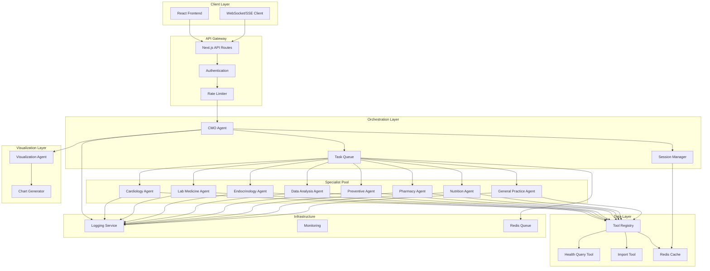
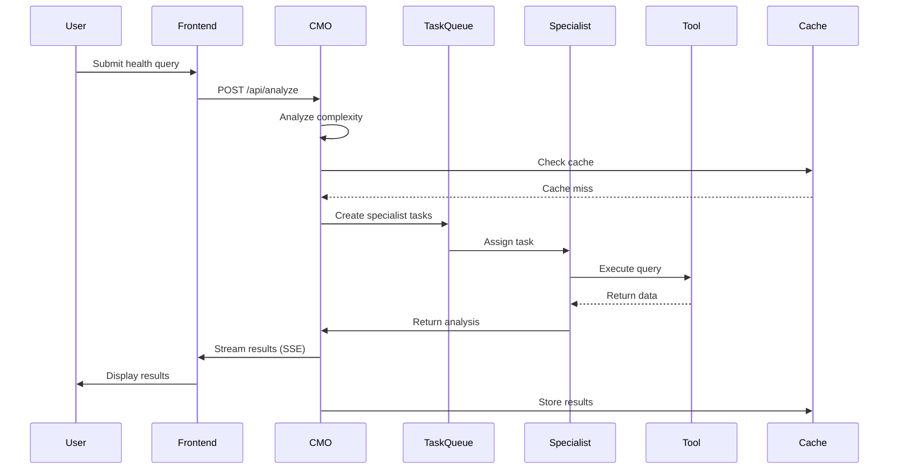
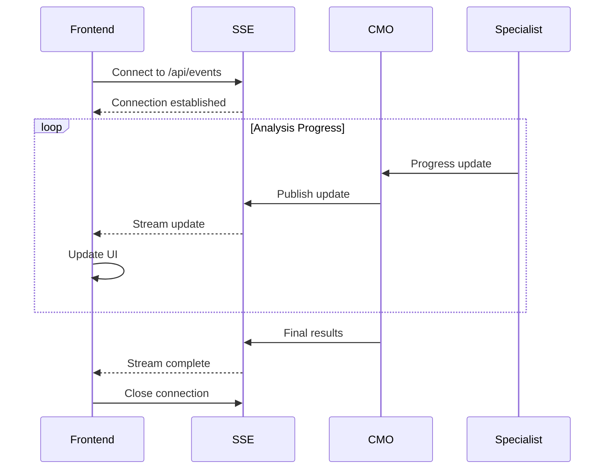

# Technical Architecture Document: Multi-Agent Health Insight System

## System Overview

The Multi-Agent Health Insight System implements a sophisticated orchestrator-worker pattern where specialized medical AI agents collaborate to provide comprehensive health insights. Based on Anthropic's proven multi-agent architecture, the system achieves 90.2% better performance than single-agent approaches by enabling parallel analysis across multiple medical domains.

## Architecture Principles

### 1. Separation of Concerns
Each agent has a specific medical domain expertise and operates independently within its scope. This allows for:
- Deep specialization without knowledge dilution
- Parallel execution without conflicts
- Easy addition of new specialists
- Fault isolation between agents

### 2. Tool-Based Data Access
All health data access is abstracted through pre-built tools:
- No direct database connections in agents
- Consistent interface for data retrieval
- Built-in security and access control
- Natural language query capabilities

### 3. Streaming-First Design
Real-time updates keep users engaged:
- Server-Sent Events (SSE) for progress updates
- Streaming responses for long-running analyses
- Progressive result disclosure
- Optimistic UI updates

### 4. Scalability Through Queuing
Task distribution enables horizontal scaling:
- Redis-based task queue
- Worker pool for specialist agents
- Auto-scaling based on queue depth
- Priority queuing for simple queries

## System Architecture Diagram



## Component Descriptions

### Frontend Layer

#### React Application
- **Technology**: Next.js 14 with App Router
- **State Management**: Zustand for global state, React Query for server state
- **UI Framework**: Tailwind CSS with custom medical theme
- **Visualization**: Recharts for interactive charts
- **Real-time**: EventSource API for SSE connections

#### Three-Panel Layout
1. **Left Panel**: Conversation management and navigation
2. **Center Panel**: Chat interface and agent responses
3. **Right Panel**: Medical team status and visualizations

### API Gateway

#### Next.js API Routes
- RESTful endpoints for standard operations
- SSE endpoints for streaming responses
- WebSocket support for bi-directional communication
- Request validation using Zod schemas

#### Authentication & Authorization
- JWT-based authentication
- Role-based access control (RBAC)
- API key management for external integrations
- Session management with secure cookies

### Orchestration Layer

#### Chief Medical Officer (CMO) Agent
The CMO is the central orchestrator responsible for:

```typescript
interface CMOResponsibilities {
  // Query Analysis
  analyzeQueryComplexity(query: string): QueryComplexity;
  determineRequiredSpecialists(query: string, initialData: any): Specialist[];
  
  // Team Coordination
  delegateToSpecialists(specialists: Specialist[], tasks: Task[]): Promise<Results[]>;
  monitorProgress(taskIds: string[]): AsyncGenerator<ProgressUpdate>;
  
  // Result Synthesis
  synthesizeResults(results: SpecialistResult[]): ComprehensiveAnalysis;
  generateSummary(analysis: ComprehensiveAnalysis): ExecutiveSummary;
}
```

#### Task Queue System
- **Technology**: Bull Queue with Redis backend
- **Features**:
  - Priority queuing (simple queries get fast-tracked)
  - Retry logic with exponential backoff
  - Dead letter queue for failed tasks
  - Concurrent job processing

### Specialist Agents

Each specialist agent follows a common interface:

```typescript
interface SpecialistAgent {
  name: string;
  specialty: MedicalDomain;
  
  // Core analysis method
  analyze(context: AnalysisContext): Promise<SpecialistResult>;
  
  // Tool usage
  tools: ToolDefinition[];
  executeQuery(query: string): Promise<QueryResult>;
  
  // Confidence scoring
  assessConfidence(result: any): number;
}
```

#### Specialist Capabilities

1. **Cardiology Specialist**
   - Analyzes cardiovascular metrics
   - Calculates risk scores
   - Identifies concerning patterns

2. **Laboratory Medicine Specialist**
   - Interprets lab results
   - Compares against reference ranges
   - Identifies abnormal patterns

3. **Endocrinology Specialist**
   - Analyzes hormonal data
   - Manages diabetes metrics
   - Evaluates metabolic health

4. **Data Analysis Specialist**
   - Performs statistical analysis
   - Identifies correlations
   - Generates predictions

5. **Preventive Medicine Specialist**
   - Assesses health risks
   - Recommends screenings
   - Provides prevention strategies

6. **Pharmacy Specialist**
   - Analyzes medications
   - Checks interactions
   - Monitors adherence

7. **Nutrition Specialist**
   - Evaluates dietary patterns
   - Analyzes weight trends
   - Provides nutritional guidance

8. **General Practice Specialist**
   - Provides holistic view
   - Coordinates findings
   - Identifies gaps

### Data Access Layer

#### Tool Registry Pattern
```typescript
class ToolRegistry {
  private tools: Map<string, Tool>;
  
  registerTool(name: string, tool: Tool): void;
  
  async executeTool(
    toolName: string, 
    params: any, 
    context: ExecutionContext
  ): Promise<ToolResult>;
  
  getToolDefinitions(): ToolDefinition[];
}
```

#### Health Query Tool Integration
- Natural language to SQL via Snowflake Cortex
- Automatic query optimization
- Result caching for common queries
- Fallback mechanisms for query failures

### Communication Patterns

#### Query Flow


#### Real-time Updates


## Data Flow Architecture

### Query Classification Pipeline
```python
def classify_query_complexity(query: str) -> QueryComplexity:
    indicators = {
        'simple': ['what is', 'show me', 'latest'],
        'standard': ['trend', 'compare', 'over time'],
        'complex': ['correlate', 'analyze', 'relationship'],
        'critical': ['comprehensive', 'all', 'everything']
    }
    
    # ML-based classification with fallback rules
    complexity_score = calculate_complexity_score(query)
    return map_score_to_complexity(complexity_score)
```

### Parallel Execution Strategy
```typescript
async function executeSpecialistTasks(tasks: Task[]): Promise<Result[]> {
  // Group tasks by priority
  const priorityGroups = groupByPriority(tasks);
  
  // Execute high-priority tasks first
  const criticalResults = await Promise.all(
    priorityGroups.critical.map(task => executeTask(task))
  );
  
  // Execute remaining tasks in parallel with concurrency limit
  const results = await pMap(
    priorityGroups.normal,
    executeTask,
    { concurrency: 5 }
  );
  
  return [...criticalResults, ...results];
}
```

## Scalability Considerations

### Horizontal Scaling
- Specialist agents run in containerized workers
- Kubernetes-based orchestration
- Auto-scaling based on queue depth and response times
- Load balancing across multiple CMO instances

### Caching Strategy
- Query result caching with TTL
- User-specific cache isolation
- Invalidation on data updates
- Distributed cache using Redis Cluster

### Performance Optimization
- Connection pooling for database access
- Query result streaming for large datasets
- Lazy loading of visualization components
- CDN for static assets

## Security Architecture

### Data Protection
- End-to-end encryption for health data
- At-rest encryption in databases
- TLS 1.3 for all communications
- Key rotation policies

### Access Control
```typescript
interface SecurityPolicy {
  authentication: {
    method: 'JWT' | 'OAuth2';
    expirationTime: number;
    refreshStrategy: 'sliding' | 'absolute';
  };
  
  authorization: {
    model: 'RBAC' | 'ABAC';
    permissions: Permission[];
    dataIsolation: 'user' | 'tenant';
  };
  
  audit: {
    logLevel: 'basic' | 'detailed';
    retention: number; // days
    piiHandling: 'mask' | 'exclude';
  };
}
```

### HIPAA Compliance
- Audit trails for all data access
- Encryption standards compliance
- Access controls and authentication
- Data retention and disposal policies

## Monitoring and Observability

### Metrics Collection
- Prometheus for metrics aggregation
- Custom metrics for agent performance
- Business metrics (queries processed, insights generated)
- Infrastructure metrics (CPU, memory, queue depth)

### Logging Architecture
```typescript
interface LoggingStrategy {
  structured: true;
  format: 'JSON';
  levels: ['error', 'warn', 'info', 'debug'];
  
  contextFields: {
    userId: string;    // hashed
    sessionId: string;
    agentId: string;
    queryId: string;
    timestamp: ISO8601;
  };
  
  piiScrubbing: {
    enabled: true;
    patterns: RegExp[];
  };
}
```

### Distributed Tracing
- OpenTelemetry for trace collection
- Trace ID propagation across agents
- Visualization in Jaeger or similar
- Performance bottleneck identification

## Error Handling and Recovery

### Agent Failure Handling
```typescript
class AgentFailureHandler {
  async handleFailure(
    agent: Agent, 
    error: Error, 
    context: Context
  ): Promise<RecoveryAction> {
    
    if (isTransientError(error)) {
      return { action: 'retry', delay: exponentialBackoff() };
    }
    
    if (isCriticalAgent(agent)) {
      return { action: 'fallback', alternativeAgent: getBackupAgent() };
    }
    
    return { 
      action: 'partial-results', 
      message: 'Some analyses unavailable' 
    };
  }
}
```

### Circuit Breaker Pattern
- Prevents cascading failures
- Automatic recovery testing
- Gradual traffic restoration
- Fallback to cached results

## Deployment Architecture

### Container Strategy
- Docker containers for all services
- Multi-stage builds for optimization
- Non-root user execution
- Health checks and readiness probes

### Kubernetes Configuration
```yaml
apiVersion: apps/v1
kind: Deployment
metadata:
  name: specialist-agents
spec:
  replicas: 3
  strategy:
    type: RollingUpdate
    rollingUpdate:
      maxSurge: 1
      maxUnavailable: 0
  template:
    spec:
      containers:
      - name: specialist
        resources:
          requests:
            memory: "512Mi"
            cpu: "500m"
          limits:
            memory: "1Gi"
            cpu: "1000m"
```

### Environment Configuration
- Environment-specific configs
- Secret management via Kubernetes Secrets
- Feature flags for gradual rollouts
- Blue-green deployment support

## Future Extensibility

### Adding New Specialists
1. Implement the SpecialistAgent interface
2. Register with the CMO's specialist registry
3. Define tool requirements
4. Add to task routing logic
5. Update UI to show new specialist

### Domain Adaptation
The architecture supports adaptation to other domains:
- Financial analysis (replace medical specialists with financial analysts)
- Legal research (replace with legal specialists)
- Educational tutoring (replace with subject matter experts)

### Plugin Architecture
```typescript
interface AgentPlugin {
  name: string;
  version: string;
  domain: string;
  
  register(registry: AgentRegistry): void;
  capabilities(): Capability[];
  initialize(config: PluginConfig): Promise<void>;
}
```

This architecture provides a robust, scalable foundation for multi-agent collaboration while maintaining flexibility for future enhancements and domain adaptations.