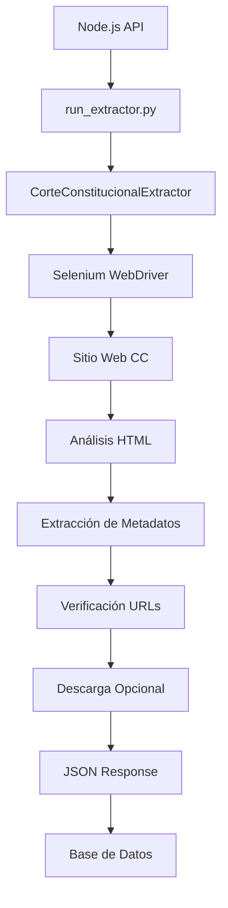

# Sistema de Web Scraping Jurídico

## 🎯 Visión General

El Sistema de Web Scraping Jurídico es un componente especializado del **Sistema Editorial Jurídico Supervisado** diseñado para la extracción automatizada de documentos jurídicos de fuentes oficiales, específicamente enfocado en la **Corte Constitucional de Colombia**.

### Características Principales

- 🔍 **Extracción Inteligente**: Búsqueda automática en días hábiles anteriores cuando no hay documentos recientes
- 🚗 **Web Scraping Robusto**: Implementado con Selenium para manejar sitios web dinámicos
- 📊 **Integración Completa**: Comunicación directa con la API del sistema editorial
- ⚡ **Optimización de Rendimiento**: Cache de URLs y verificación inteligente de documentos
- 🛡️ **Manejo de Errores**: Sistema resiliente con múltiples estrategias de recuperación

## 🏗️ Arquitectura del Sistema

### Estructura de Directorios

```
backend/services/scraping/
├── base.py                        # Clase base abstracta para extractores
├── corte_constitucional_extractor.py  # Extractor especializado CC
├── run_extractor.py              # Script de ejecución principal  
├── download_single.py            # Descarga de documentos individuales
├── venv/                        # Entorno virtual Python
└── documents/                   # Directorio de almacenamiento local
    ├── rtf/                    # Documentos RTF
    └── docx/                   # Documentos DOCX
```

### Componentes Principales

#### 1. **BaseExtractor** (`base.py`)

Clase abstracta que define la interfaz común para todos los extractores jurídicos.

```python
@dataclass
class DocumentMetadata:
    source: str                  # Fuente del documento (ej: "corte_constitucional")
    document_id: str            # ID único del documento (ej: "T-343/25")
    title: str                  # Título completo de la sentencia
    date: datetime              # Fecha de la sentencia
    court: str                  # Tribunal emisor
    document_type: str          # Tipo de sentencia (T, C, SU, A)
    pdf_url: str               # URL del documento RTF/DOCX
    html_url: str              # URL de la versión HTML
    extraction_date: datetime   # Fecha de extracción
    magistrate: str            # Magistrado ponente
```

#### 2. **CorteConstitucionalExtractor** (`corte_constitucional_extractor.py`)

Extractor especializado que implementa la lógica específica para la Corte Constitucional.

**Características técnicas:**
- **Driver**: Selenium WebDriver con Chrome headless
- **Estrategia de búsqueda**: Días hábiles retrospectivos (7 días normal, 15 extendido)
- **Patrones de reconocimiento**: Regex avanzado para identificar sentencias
- **Verificación de URLs**: Sistema de cache con TTL de 1 hora
- **Formatos soportados**: RTF, DOCX

#### 3. **Script de Ejecución** (`run_extractor.py`)

Interfaz de línea de comandos para ejecutar el extractor desde Node.js.

**Parámetros:**
```bash
--source corte_constitucional  # Fuente a extraer
--limit 10                    # Número máximo de documentos
--download                    # Flag para descarga local opcional
```

#### 4. **Descarga Individual** (`download_single.py`)

Utilidad para descargar documentos específicos por URL e ID.

## 🔧 Configuración y Instalación

### Prerrequisitos

```bash
# Python 3.9+
python3 --version

# Google Chrome (para Selenium)
google-chrome --version
```

### Instalación del Entorno Virtual

```bash
cd backend/services/scraping/
python3 -m venv venv
source venv/bin/activate  # En Windows: venv\Scripts\activate
pip install -r requirements.txt
```

### Dependencias Principales

```python
# Web Scraping
selenium==4.15.2
webdriver-manager==4.0.1

# HTTP Requests  
requests==2.31.0

# Procesamiento de datos
python-dateutil==2.8.2
```

## 🚀 Uso del Sistema

### 1. Extracción Básica

```bash
# Extraer 5 documentos sin descargar
python run_extractor.py --source corte_constitucional --limit 5

# Extraer y descargar documentos
python run_extractor.py --source corte_constitucional --limit 10 --download
```

### 2. Desde Node.js (Integración Completa)

```javascript
// backend/src/services/ScrapingService.ts
const result = await execAsync(`
    ${pythonPath} ./backend/services/scraping/run_extractor.py 
    --source corte_constitucional 
    --limit ${limit}
`);
```

### 3. Descarga Individual

```bash
python download_single.py \
    --url "https://www.corteconstitucional.gov.co/sentencias/2025/t-343-25.rtf" \
    --id "T-343/25"
```

## ⚙️ Funcionamiento Interno

### Algoritmo de Búsqueda de Días Hábiles

```python
def _get_extraction_dates(self, extended_search: bool = False):
    # Configuración de búsqueda
    days_to_search = 15 if extended_search else 7
    
    # Búsqueda solo en días hábiles (lunes-viernes)
    current_date = datetime.now()
    while days_added < days_to_search:
        if current_date.weekday() < 5:  # 0=lunes, 4=viernes
            dates_to_extract.append(current_date)
            days_added += 1
        current_date -= timedelta(days=1)
```

### Patrones de Reconocimiento de Sentencias

```python
sentence_patterns = [
    r'([TCG]-\d{1,4}[/-]\d{2,4})',    # T-343/25, C-123/25
    r'(SU\.\d{1,4}[/-]\d{2,4})',     # SU.123/25
    r'(SU-\d{1,4}[/-]\d{2,4})',      # SU-123/25  
    r'([A]-\d{1,4}[/-]\d{2,4})',     # A-123/25
    r'([TCG]\d{1,4}[/-]\d{2,4})',    # Sin guión
    r'(SU\d{1,4}[/-]\d{2,4})'        # SU sin punto
]
```

### Generación de URLs

```python
def _generate_document_url(self, sentence_number: str) -> str:
    """
    Transforma: T-343/25 → t-343-25.rtf
    URL final: https://www.corteconstitucional.gov.co/sentencias/2025/t-343-25.rtf
    """
    clean_number = sentence_number.strip().upper()
    normalized_id = clean_number.lower().replace('/', '-')
    return f"{base_url}/sentencias/{year}/{normalized_id}.rtf"
```

## 📊 Flujo de Datos



## 🔍 Tipos de Documentos Extraídos

### Sentencias de Tutela (T)
- **Formato**: T-XXX/YY (ej: T-343/25)
- **Descripción**: Protección de derechos fundamentales
- **Frecuencia**: Múltiples diarias

### Sentencias de Constitucionalidad (C)  
- **Formato**: C-XXX/YY (ej: C-223/25)
- **Descripción**: Control constitucional de normas
- **Frecuencia**: Semanal aproximadamente

### Sentencias de Unificación (SU)
- **Formato**: SU-XXX/YY o SU.XXX/YY
- **Descripción**: Unificación de jurisprudencia
- **Frecuencia**: Ocasional

### Autos (A)
- **Formato**: A-XXX/YY
- **Descripción**: Decisiones procesales
- **Frecuencia**: Variable

## 📈 Métricas y Monitoreo

### Logging Estructurado

```python
# Configuración de logging
logging.basicConfig(
    level=logging.INFO,
    format='%(asctime)s | %(levelname)-8s | %(message)s'
)

# Ejemplos de logs
logger.info("🚀 Iniciando extracción - Fuente: corte_constitucional, Límite: 10")
logger.info("🔍 Buscando en 7 fechas hábiles") 
logger.info("✅ 4 sentencias encontradas para 3 de septiembre de 2025")
logger.warning("❌ URL inválida: T-343/25")
```

### Métricas de Rendimiento

- **Tiempo de extracción**: ~30-45 segundos por ejecución
- **Documentos por ejecución**: 0-10 documentos típicamente
- **Tasa de éxito URLs**: >80% de URLs válidas
- **Cache hit ratio**: >60% en URLs verificadas

## 🛠️ Configuración Avanzada

### Optimización de Chrome WebDriver

```python
chrome_options = Options()
chrome_options.add_argument("--headless=new")      # Sin interfaz gráfica
chrome_options.add_argument("--no-sandbox")        # Seguridad containers
chrome_options.add_argument("--disable-gpu")       # Sin aceleración GPU
chrome_options.add_argument("--disable-images")    # Sin carga de imágenes
chrome_options.add_argument("--window-size=1920,1080")  # Resolución fija
```

### Manejo de Errores

```python
try:
    documents = extractor.extract_latest_sentences(limit)
except TimeoutException:
    logger.warning("⚠️ Timeout esperando carga de Angular")
except NoSuchElementException:
    logger.error("❌ Elemento no encontrado en DOM")
except Exception as e:
    logger.error(f"❌ Error inesperado: {e}")
```

## 🔒 Seguridad y Buenas Prácticas

### Headers de Solicitud

```python
headers = {
    'User-Agent': 'SistemaEditorialJuridico/1.0',
    'Accept': 'text/html,application/xhtml+xml,application/xml;q=0.9,*/*;q=0.8',
    'Accept-Language': 'es-CO,es;q=0.8,en;q=0.6',
    'Accept-Encoding': 'gzip, deflate',
    'Connection': 'keep-alive',
}
```

### Límites de Rate

- **Delay entre páginas**: 1-3 segundos
- **Timeout de página**: 30 segundos máximo
- **Reintentos**: Hasta 3 intentos por documento
- **Cache TTL**: 1 hora para verificación de URLs

### Validación de Contenido

```python
def _verify_document_url(self, url: str) -> bool:
    """Verifica que la URL contenga documento real, no HTML de error"""
    content_type = response.headers.get('content-type', '').lower()
    return 'text/html' not in content_type
```

## 🚨 Solución de Problemas Comunes

### Error: "URL inválida"
**Causa**: URL no accesible o retorna HTML en lugar de documento
**Solución**: Verificar patrones regex y generación de URLs

### Error: "ChromeDriver format error"
**Causa**: Driver incompatible con arquitectura del sistema
**Solución**: Configuración alternativa se aplica automáticamente

### Error: "Connection refused API"
**Causa**: API local no disponible para verificar BD vacía
**Solución**: Continúa con búsqueda normal automáticamente

### Sin documentos extraídos
**Causa**: Fechas sin sentencias publicadas
**Solución**: Aumentar número de días de búsqueda o usar modo extendido

## 🔄 Integración con el Sistema Principal

### API Endpoints Relacionados

```typescript
// Trigger de extracción
POST /api/scraping/extract
{
  "source": "corte_constitucional",
  "limit": 10,
  "download": false
}

// Estado de extracción  
GET /api/scraping/status/:jobId

// Documentos extraídos
GET /api/documents?source=corte_constitucional&recent=true
```

### Base de Datos

Los documentos extraídos se almacenan en la tabla `documents` con:

```sql
-- Campos específicos de scraping
source: 'corte_constitucional'
document_id: 'T-343/25' 
pdf_url: 'https://www.corteconstitucional.gov.co/sentencias/2025/t-343-25.rtf'
extraction_date: TIMESTAMP
status: 'scraped' | 'downloaded' | 'processed'
```

## 📅 Mantenimiento y Actualizaciones

### Tareas Periódicas

- **Diario**: Verificación automática de nuevos documentos
- **Semanal**: Limpieza de cache y archivos temporales  
- **Mensual**: Actualización de dependencias Python
- **Trimestral**: Revisión de patrones de extracción

### Logs de Auditoria

Todos los procesos de scraping se registran en:
- **Sistema de logs**: Winston (Node.js) + Python logging
- **Base de datos**: Tabla `audit_logs` con detalles de extracción
- **Métricas**: Tiempo de respuesta, éxito/fallo, documentos encontrados

## 🔮 Planes Futuros

### Próximas Fuentes
- **Consejo de Estado**: Sentencias de lo contencioso administrativo
- **Corte Suprema de Justicia**: Casación civil y penal  
- **Tribunales Superiores**: Decisiones de segunda instancia

### Mejoras Técnicas
- **Paralelización**: Extracción simultánea de múltiples fuentes
- **Machine Learning**: Clasificación automática por temas jurídicos
- **OCR Integration**: Procesamiento de documentos escaneados
- **Real-time**: Notificaciones push de nuevos documentos

---

**Versión del Documento**: 1.0  
**Última Actualización**: Septiembre 2025  
**Mantenido por**: Sistema Editorial Jurídico Supervisado