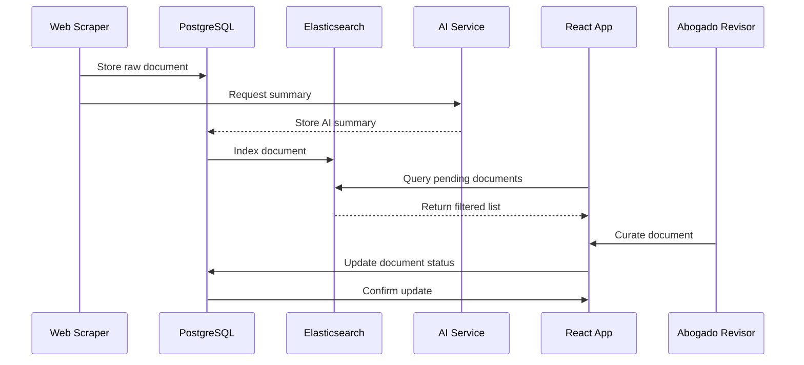
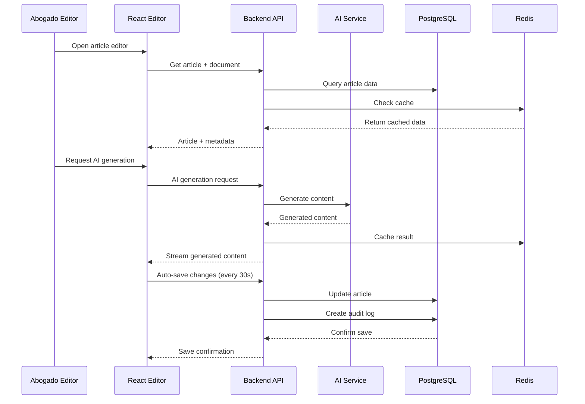
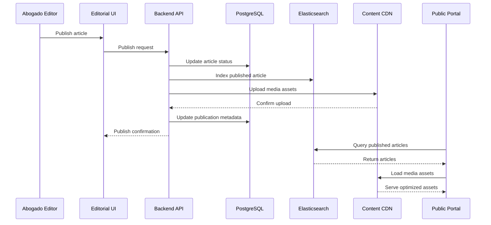

# Arquitectura del Sistema - Sistema Editorial Jurídico Supervisado

## Visión General de la Arquitectura

### Patrón Arquitectónico Principal
**Arquitectura por Capas Híbrida** con elementos de **Microservicios** para servicios especializados.

```
┌─────────────────────────────────────────────────────────────┐
│                    CAPA DE PRESENTACIÓN                    │
│  React SPA + TypeScript + Tailwind CSS + Zustand         │
└─────────────────────────────────────────────────────────────┘
                                │
┌─────────────────────────────────────────────────────────────┐
│                 CAPA DE LÓGICA DE NEGOCIO                 │
│     Node.js + Express + TypeScript + Business Logic       │
└─────────────────────────────────────────────────────────────┘
                                │
┌─────────────────────────────────────────────────────────────┐
│                    CAPA DE SERVICIOS                      │
│  AI Services + Scraping Service + Notification Service    │
└─────────────────────────────────────────────────────────────┘
                                │
┌─────────────────────────────────────────────────────────────┐
│                   CAPA DE DATOS                           │
│     PostgreSQL + Redis + S3 + Elasticsearch              │
└─────────────────────────────────────────────────────────────┘
```

### Principios Arquitectónicos
1. **Separación de Responsabilidades**: Cada capa tiene responsabilidades claramente definidas
2. **Alta Cohesión, Bajo Acoplamiento**: Componentes cohesivos con interfaces bien definidas
3. **Escalabilidad Horizontal**: Servicios pueden escalar independientemente
4. **Resilencia**: Tolerancia a fallos con degradación elegante
5. **Observabilidad**: Logging, monitoring y tracing en todos los niveles

## Arquitectura Detallada por Capas

### Capa de Presentación (Frontend)

#### Stack Tecnológico
- **Framework**: React 18 con TypeScript
- **Estado Global**: Zustand + React Query
- **Styling**: Tailwind CSS + Headless UI
- **Build Tools**: Vite + ESBuild
- **Testing**: Vitest + React Testing Library

#### Organización Modular
```
src/
├── modules/
│   ├── curation/           # Módulo de curación
│   │   ├── components/
│   │   ├── hooks/
│   │   ├── stores/
│   │   └── services/
│   ├── editorial/          # Módulo de edición
│   │   ├── components/
│   │   ├── hooks/
│   │   └── stores/
│   ├── multimedia/         # Módulo de multimedia
│   └── public-portal/      # Portal público
├── shared/
│   ├── components/         # Componentes compartidos
│   ├── hooks/             # Hooks compartidos
│   ├── utils/             # Utilidades
│   └── types/             # Tipos TypeScript
└── core/
    ├── api/               # Cliente API
    ├── auth/              # Autenticación
    └── config/            # Configuración
```

#### Patrones de Comunicación Frontend
- **Estado Local**: React Hooks para estado de componente
- **Estado Global**: Zustand para estado de aplicación
- **Cache de Servidor**: React Query para datos remotos
- **Comunicación Tiempo Real**: Server-Sent Events + EventSource

### Capa de Lógica de Negocio (Backend API)

#### Stack Tecnológico
- **Runtime**: Node.js 20 LTS
- **Framework**: Express.js + TypeScript
- **ORM**: Prisma con PostgreSQL
- **Validación**: Zod + express-validator
- **Autenticación**: JWT + Passport.js
- **Documentación**: OpenAPI 3.0 + Swagger

#### Estructura del API Gateway
```
backend/
├── src/
│   ├── controllers/        # Controladores REST
│   │   ├── documents/
│   │   ├── articles/
│   │   ├── ai/
│   │   └── media/
│   ├── services/          # Lógica de negocio
│   │   ├── DocumentService.ts
│   │   ├── ArticleService.ts
│   │   ├── AIOrchestrator.ts
│   │   └── NotificationService.ts
│   ├── middleware/        # Middleware Express
│   │   ├── auth.ts
│   │   ├── validation.ts
│   │   ├── errorHandler.ts
│   │   └── rateLimiting.ts
│   ├── models/           # Modelos de datos (Prisma)
│   └── utils/            # Utilidades compartidas
└── prisma/
    ├── schema.prisma     # Schema de base de datos
    └── migrations/       # Migraciones
```

#### Patrones de Comunicación Backend
- **API REST**: Para operaciones CRUD estándar
- **Server-Sent Events**: Para notificaciones tiempo real
- **Queue System**: Bull/BullMQ con Redis para tareas asíncronas
- **Event Sourcing**: Para auditoría y historial de cambios

### Capa de Servicios Especializados

#### AI Orchestrator Service
**Tecnología**: Python + FastAPI + Celery  
**Responsabilidades**:
- Gestión de múltiples proveedores de IA (OpenAI, Anthropic, Gemini)
- Load balancing y failover entre servicios
- Rate limiting y cost optimization
- Cache inteligente de resultados

```python
# Arquitectura del AI Service
services/ai-orchestrator/
├── app/
│   ├── providers/         # Adaptadores para cada proveedor IA
│   │   ├── openai_provider.py
│   │   ├── anthropic_provider.py
│   │   └── gemini_provider.py
│   ├── orchestrator/      # Lógica de orquestación
│   │   ├── content_generator.py
│   │   ├── image_generator.py
│   │   └── load_balancer.py
│   ├── cache/            # Sistema de cache
│   └── monitoring/       # Métricas y health checks
└── workers/              # Celery workers
    ├── content_worker.py
    └── image_worker.py
```

#### Web Scraping Service
**Tecnología**: Python + Scrapy + Selenium  
**Responsabilidades**:
- Monitoreo de fuentes jurídicas oficiales
- Extracción de documentos y metadata
- Detección de cambios y actualizaciones
- Pipeline de procesamiento y limpieza

```python
services/scraper/
├── spiders/              # Scrapy spiders
│   ├── boe_spider.py
│   ├── tribunals_spider.py
│   └── ministries_spider.py
├── pipelines/            # Processing pipelines
│   ├── cleaning.py
│   ├── validation.py
│   └── storage.py
├── schedulers/           # Scheduled scraping
└── monitoring/           # Health checks y alertas
```

#### Notification Service
**Tecnología**: Node.js + Express + Socket.io  
**Responsabilidades**:
- Gestión de notificaciones en tiempo real
- Templates de notificaciones
- Múltiples canales (email, push, in-app)
- Analytics de engagement

### Capa de Datos

#### Base de Datos Principal - PostgreSQL
**Esquema Lógico**:
```sql
-- Tablas principales
users (id, email, profile_data, preferences, created_at)
documents (id, title, source, content_path, metadata, status)
articles (id, title, content, seo_data, status, published_at)
article_versions (id, article_id, version_number, content, created_at)
media_assets (id, filename, file_path, metadata, usage_data)
audit_logs (id, user_id, action, resource_id, details, timestamp)

-- Índices optimizados
CREATE INDEX idx_documents_status_date ON documents(status, publication_date);
CREATE INDEX idx_articles_published ON articles(status, published_at) WHERE status = 'published';
CREATE INDEX idx_audit_logs_user_time ON audit_logs(user_id, timestamp);
```

#### Cache Layer - Redis
**Configuración Multi-Instance**:
- **Cache Instance**: Datos de sesión y cache de consultas (TTL: 1-24 horas)
- **Queue Instance**: Jobs de background processing
- **Realtime Instance**: Datos para comunicación tiempo real

```redis
# Estructura de datos típica
session:{user_id} -> {session_data}          # TTL: 24h
article:cache:{id} -> {article_json}         # TTL: 1h  
ai:result:{hash} -> {generated_content}      # TTL: 7d
queue:ai_requests -> [job1, job2, ...]       # Queue
pub/sub:notifications -> real-time events
```

#### Search Engine - Elasticsearch
**Índices Especializados**:
```json
{
  "documents_index": {
    "mappings": {
      "properties": {
        "title": {"type": "text", "analyzer": "spanish"},
        "content": {"type": "text", "analyzer": "spanish"},
        "legal_area": {"type": "keyword"},
        "publication_date": {"type": "date"},
        "source": {"type": "keyword"}
      }
    }
  },
  "articles_index": {
    "mappings": {
      "properties": {
        "title": {"type": "text", "analyzer": "spanish"},
        "content": {"type": "text", "analyzer": "spanish"},
        "keywords": {"type": "keyword"},
        "seo_data": {"type": "nested"}
      }
    }
  }
}
```

#### Object Storage - AWS S3 / MinIO
**Organización de Buckets**:
```
editorial-documents/        # Documentos fuente originales
  ├── 2024/01/             # Organizados por año/mes
  ├── 2024/02/
  └── ...

editorial-media/           # Assets multimedia
  ├── original/            # Archivos originales
  ├── optimized/          # Versiones optimizadas
  └── thumbnails/         # Miniaturas

editorial-backups/         # Backups automáticos
  ├── database/
  └── media/
```

## Flujo de Datos Completo

### Flujo de Curación de Documentos


### Flujo de Edición de Artículos


### Flujo de Publicación


## Arquitectura de Comunicación en Tiempo Real

### Server-Sent Events (SSE) Architecture
```typescript
// Backend SSE Controller
class SSEController {
  private connections = new Map<string, Response>();
  
  async connect(req: Request, res: Response) {
    const userId = req.user.id;
    
    res.writeHead(200, {
      'Content-Type': 'text/event-stream',
      'Cache-Control': 'no-cache',
      'Connection': 'keep-alive',
      'Access-Control-Allow-Origin': '*'
    });
    
    this.connections.set(userId, res);
    
    // Heartbeat cada 30 segundos
    const heartbeat = setInterval(() => {
      this.sendEvent(userId, 'heartbeat', { timestamp: Date.now() });
    }, 30000);
    
    req.on('close', () => {
      clearInterval(heartbeat);
      this.connections.delete(userId);
    });
  }
  
  sendEvent(userId: string, type: string, data: any) {
    const connection = this.connections.get(userId);
    if (connection) {
      connection.write(`event: ${type}\n`);
      connection.write(`data: ${JSON.stringify(data)}\n\n`);
    }
  }
}
```

### Event Broadcasting System
```typescript
// Event Bus para comunicación entre servicios
class EventBus {
  private redis: Redis;
  
  async publish(channel: string, event: SystemEvent) {
    await this.redis.publish(channel, JSON.stringify(event));
  }
  
  subscribe(channel: string, handler: EventHandler) {
    this.redis.subscribe(channel);
    this.redis.on('message', (receivedChannel, message) => {
      if (receivedChannel === channel) {
        handler(JSON.parse(message));
      }
    });
  }
}

// Canales principales
const CHANNELS = {
  DOCUMENT_EVENTS: 'documents',      // document_scraped, document_curated
  ARTICLE_EVENTS: 'articles',        // article_created, article_published  
  AI_EVENTS: 'ai_operations',        // ai_generation_complete, ai_error
  USER_EVENTS: 'user_activity',      // user_login, user_action
  SYSTEM_EVENTS: 'system'            // system_maintenance, service_status
};
```

## Sistema de Gestión de Estado y Persistencia

### Estado de Aplicación (Frontend)
```typescript
// Zustand Store con persistencia
const useAppStore = create<AppState>()(
  subscribeWithSelector(
    persist(
      (set, get) => ({
        // Estado de editor
        editorState: {
          openArticles: [],
          activeArticleId: null,
          autoSaveInterval: 30000
        },
        
        // Estado de UI
        uiState: {
          sidebarCollapsed: false,
          theme: 'light',
          splitViewRatio: 0.5
        },
        
        // Cache local
        cache: new Map(),
        
        // Acciones
        actions: {
          // Métodos para actualizar estado
        }
      }),
      {
        name: 'editorial-app-storage',
        partialize: (state) => ({
          uiState: state.uiState,
          editorState: {
            autoSaveInterval: state.editorState.autoSaveInterval
          }
        }),
        version: 1,
        migrate: (persistedState, version) => {
          // Migración de versiones de estado
        }
      }
    )
  )
);
```

### Sistema de Auto-guardado
```typescript
class AutoSaveManager {
  private saveTimeouts = new Map<string, NodeJS.Timeout>();
  private lastSaveHash = new Map<string, string>();
  
  scheduleAutoSave(articleId: string, content: string, delay: number = 30000) {
    // Cancelar save anterior si existe
    const existingTimeout = this.saveTimeouts.get(articleId);
    if (existingTimeout) {
      clearTimeout(existingTimeout);
    }
    
    // Verificar si el contenido cambió
    const contentHash = this.hashContent(content);
    const lastHash = this.lastSaveHash.get(articleId);
    
    if (contentHash === lastHash) {
      return; // No hay cambios, no guardar
    }
    
    // Programar nuevo auto-save
    const timeout = setTimeout(async () => {
      try {
        await this.performAutoSave(articleId, content);
        this.lastSaveHash.set(articleId, contentHash);
      } catch (error) {
        this.handleAutoSaveError(articleId, error);
      }
    }, delay);
    
    this.saveTimeouts.set(articleId, timeout);
  }
  
  private async performAutoSave(articleId: string, content: string) {
    const result = await articleService.autoSave(articleId, { content });
    
    // Emitir evento de éxito
    eventBus.emit('autosave:success', {
      articleId,
      timestamp: Date.now(),
      wordCount: this.countWords(content)
    });
  }
}
```

## Patrones de Manejo de Errores y Reintentos

### Circuit Breaker Pattern
```typescript
class CircuitBreaker {
  private state: 'CLOSED' | 'OPEN' | 'HALF_OPEN' = 'CLOSED';
  private failureCount = 0;
  private lastFailureTime = 0;
  
  constructor(
    private threshold: number = 5,
    private timeout: number = 60000,
    private retryTimeout: number = 30000
  ) {}
  
  async execute<T>(operation: () => Promise<T>): Promise<T> {
    if (this.state === 'OPEN') {
      if (Date.now() - this.lastFailureTime > this.retryTimeout) {
        this.state = 'HALF_OPEN';
      } else {
        throw new Error('Circuit breaker is OPEN');
      }
    }
    
    try {
      const result = await operation();
      this.onSuccess();
      return result;
    } catch (error) {
      this.onFailure();
      throw error;
    }
  }
  
  private onSuccess() {
    this.failureCount = 0;
    this.state = 'CLOSED';
  }
  
  private onFailure() {
    this.failureCount++;
    this.lastFailureTime = Date.now();
    
    if (this.failureCount >= this.threshold) {
      this.state = 'OPEN';
    }
  }
}
```

### Retry Strategy con Backoff Exponencial
```typescript
class RetryStrategy {
  static async withExponentialBackoff<T>(
    operation: () => Promise<T>,
    maxAttempts: number = 3,
    baseDelay: number = 1000,
    maxDelay: number = 30000,
    backoffFactor: number = 2
  ): Promise<T> {
    let lastError: Error;
    
    for (let attempt = 1; attempt <= maxAttempts; attempt++) {
      try {
        return await operation();
      } catch (error) {
        lastError = error as Error;
        
        if (attempt === maxAttempts) {
          break;
        }
        
        // Calcular delay con jitter para evitar thundering herd
        const delay = Math.min(
          baseDelay * Math.pow(backoffFactor, attempt - 1),
          maxDelay
        );
        const jitteredDelay = delay + Math.random() * 1000;
        
        await this.sleep(jitteredDelay);
      }
    }
    
    throw lastError!;
  }
  
  private static sleep(ms: number): Promise<void> {
    return new Promise(resolve => setTimeout(resolve, ms));
  }
}
```

## Consideraciones de Escalabilidad y Seguridad

### Escalabilidad Horizontal
- **API Gateway**: Load balancing con NGINX
- **Database**: PostgreSQL con read replicas
- **Cache**: Redis Cluster para alta disponibilidad
- **Storage**: S3 con CloudFront CDN
- **AI Services**: Auto-scaling basado en queue length

### Medidas de Seguridad
- **Autenticación**: JWT con refresh tokens
- **Autorización**: RBAC (Role-Based Access Control)
- **Encriptación**: TLS 1.3 en tránsito, AES-256 en reposo
- **Rate Limiting**: Por usuario y por endpoint
- **Input Validation**: Sanitización en frontend y backend
- **Audit Trail**: Logging completo de todas las acciones

### Monitoring y Observabilidad
- **Application Monitoring**: New Relic / DataDog
- **Infrastructure**: Prometheus + Grafana
- **Logging**: ELK Stack (Elasticsearch, Logstash, Kibana)
- **Error Tracking**: Sentry
- **Performance**: Core Web Vitals monitoring